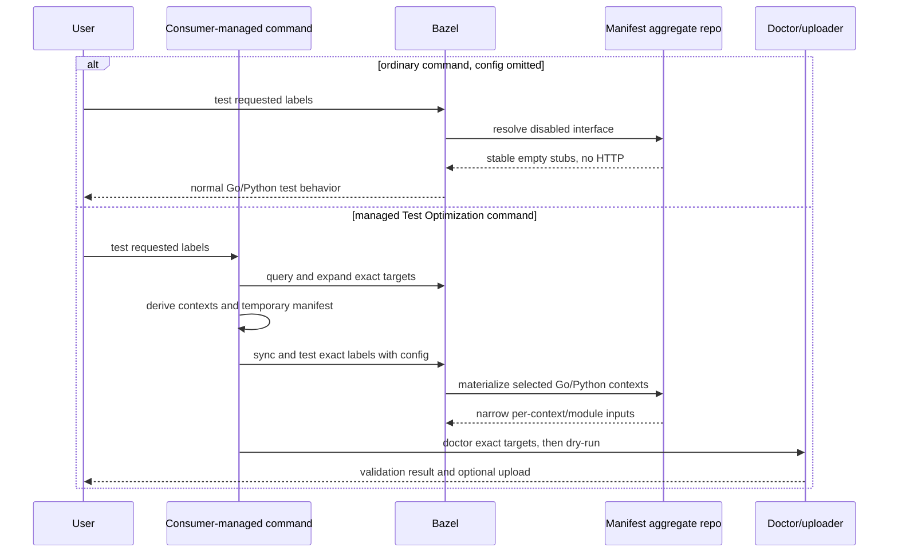

<!--
Unless explicitly stated otherwise all files in this repository are licensed under
the Apache 2.0 License.

This product includes software developed at Datadog
(https://www.datadoghq.com/) Copyright 2025-Present Datadog, Inc.
-->

# Language Onboarding

This document is organized so each language owner can read one section and wire
their runtime without having to reconstruct the rest of the repository.

Terminology used here:

- Single-service: one Datadog service for the workspace or runtime slice
- Multi-service: one runtime owns multiple Datadog services in the same Bazel workspace
- Mixed-runtime monorepo: Go, Python, Java, NodeJS, .NET, or Ruby all coexist in one repo

Rule of thumb:

- Use one sync repo for single-service setups
- Use one multi-sync aggregator per runtime for multi-service setups
- In mixed-runtime monorepos, keep one sync repo per runtime/service slice
- Use multi-sync aggregators only for multiple services of the same runtime
- Use manifest sync only behind a consumer-owned managed command that expands
  exact Go/Python targets and derives services for the current invocation

Shared runtime contract for every language:

- Tests read the synced metadata through `DD_TEST_OPTIMIZATION_MANIFEST_FILE`
- Tests set `DD_TEST_OPTIMIZATION_PAYLOADS_IN_FILES = "true"`
- Tests write payloads under `TEST_UNDECLARED_OUTPUTS_DIR/payloads/{tests,coverage}`
- Tests write JSON payload files. Do not introduce runtime proxies or raw
  msgpack-only handoff paths.
- Run the workspace's doctor target after tests to validate JSON payloads,
  Bazel target metadata, Git metadata, and invalid Go payload selection before
  upload. Small repos often use `//:dd_test_optimization_doctor`; large
  monorepos should prefer a lightweight package such as
  `//tools/test_optimization:dd_test_optimization_doctor`.
- Run uploader dry-run enrichment validation when rolling out a new repository
  or debugging missing tags: it validates the final enriched body without
  uploading or deleting local payload files.
- The uploader runs later through `bazel run`. Small repos often use
  `//:dd_upload_payloads`; large monorepos should prefer a lightweight package
  such as `//tools/test_optimization:dd_upload_payloads`.
- Mixed-runtime uploader wiring must bundle every relevant
  `:test_optimization_context` target and let the uploader choose the matching
  `context.json` per payload while consuming each repository's
  `telemetry_facts.json` for rule telemetry
- `DD_TEST_OPTIMIZATION_CONTEXT_JSON` remains a legacy explicit override, not
  the recommended mixed-runtime wiring path

Shared `.bazelrc` metadata forwarding for every runtime:

```text
common:test-optimization --repo_env=DD_API_KEY
common:test-optimization --repo_env=DD_SITE
common:test-optimization --repo_env=DD_GIT_REPOSITORY_URL
common:test-optimization --repo_env=DD_GIT_BRANCH
common:test-optimization --repo_env=DD_GIT_TAG
common:test-optimization --repo_env=DD_GIT_COMMIT_SHA
common:test-optimization --repo_env=DD_PR_NUMBER
test:test-optimization --remote_download_minimal
test:test-optimization --remote_download_regex=.*test[.]outputs.*
test:test-optimization --zip_undeclared_test_outputs
```

Go and Python config-gated onboarding also adds the single enable switch below.
Omitting the named config then provides the complete metadata and runtime
opt-out for those two integrations. This release does not change the
enablement contract of the other companions:

```text
common:test-optimization --repo_env=DD_TEST_OPTIMIZATION_ENABLED=1
```

Go workspaces also add the existing `rules_go` analysis-time setting. Prefer
the generated block from `dd_topt_go_bootstrap --print-bazelrc-snippet` or
`dd_topt_go_bootstrap --write-bazelrc`, which substitutes the consumer's actual
apparent repository name:

```text
build:test-optimization --@rules_go//go/private/orchestrion:enabled=true
# Use @io_bazel_rules_go instead of @rules_go in WORKSPACE mode.
```

Do not add that Go-only line to Python-only or other non-Go workspaces.

Pass `DD_GIT_*` only through `--repo_env`. Never forward it as test
environment data because that makes Git metadata part of the test action cache
key. For Go/Orchestrion, do not put `DD_TEST_OPTIMIZATION_AGENT_URL` or
`DD_TEST_OPTIMIZATION_AGENTLESS_URL` in `--test_env`; the uploader reads upload
endpoints at `bazel run` time.

`FETCH_SALT` is not part of the normal flow. Use it only in a separate
force-refresh command such as
`bazel sync --config=test-optimization --only=<repo_name> --repo_env=FETCH_SALT="$(date +%s)"`
when you intentionally need fresh backend metadata; do not add it to normal
test, doctor, or uploader commands.

Shared upload command:

```bash
# Vendor the full tools/test_optimization/ helper directory, or set
# DD_TEST_OPTIMIZATION_SUPPORT_BUNDLE_COLLECTOR to create_support_bundle.py.
tools/test_optimization/run_test_optimization_ci.sh \
  --doctor-target //tools/test_optimization:dd_test_optimization_doctor \
  --upload-target //tools/test_optimization:dd_upload_payloads \
  --report-dir .topt/reports \
  --support-bundle .topt/reports/dd-test-optimization-support.zip \
  //...

# Add --upload to send every available fresh valid payload after validation attempts.
DD_API_KEY="$DD_API_KEY" DD_SITE="$DD_SITE" \
  tools/test_optimization/run_test_optimization_ci.sh \
    --doctor-target //tools/test_optimization:dd_test_optimization_doctor \
    --upload-target //tools/test_optimization:dd_upload_payloads \
    --report-dir .topt/reports \
    --support-bundle .topt/reports/dd-test-optimization-support.zip \
    --upload \
    //...
```

## Automatic managed Go/Python monorepos

This path is separate from the static recipes below. It is appropriate when a
large consumer already owns a command or pipeline adapter that can expand the
requested Bazel targets before running tests.

The consumer command:

1. expands target patterns and suites to canonical local labels;
2. identifies eligible targets created through the repository's central
   `dd_go_test` or `dd_py_test` macro;
3. derives a service and runtime context from each full label;
4. writes a private invocation-scoped manifest;
5. runs the exact labels with `--config=test-optimization`, then doctor and
   uploader dry-run.

The Rule does not discover affected tests and does not prescribe a repository's
service grammar. A common consumer policy is to derive an application service
when the full package path contains a stable application segment and otherwise
fall back to the owning domain. The manifest records whether each target used
`application` or `domain_fallback` derivation. Ambiguous names or conflicting
runtime contexts must fail; they must not silently map to a global fallback.

Central wrappers load `topt_data_by_target` from the aggregate repository and
look up the current full label. A selected label delegates to
`dd_topt_go_test` or `dd_topt_py_test`. An absent label follows the same raw
test path used without Test Optimization. This keeps adding and removing
services mechanical:

- adding a new Go or Python test requires no Test Optimization BUILD edit;
- including its label in the managed invocation enrolls it automatically;
- removing the label from that invocation removes it from that run;
- no checked-in service list, `examples.bzl`, Gazelle extension, or ownership
  registry is required.



The aggregate repository is declared once using
`test_optimization_manifest_sync` or
`test_optimization_manifest_sync_extension`. Doctor/uploader wiring uses
`@test_optimization_data//:test_optimization_context` and
`@test_optimization_data//:expected_targets`; see the
[Installation Reference](Installation_Reference.md#manifest-driven-managed-gopython-monorepos).
The private manifest handoff belongs to the managed command and must not be
copied into ordinary `.bazelrc` configuration.

Automatic manifest onboarding supports Go and Python in this release. Java,
NodeJS, .NET, and Ruby continue to use the static single-service or static
multi-service recipes in their sections below.

## Go

### Single-service

Recommended path: use the Go companion bootstrap for fresh single-service Go
workspaces.

```bzl
# MODULE.bazel
bazel_dep(name = "datadog-rules-test-optimization", version = "1.2.0")
git_override(
    module_name = "datadog-rules-test-optimization",
    remote = "https://github.com/DataDog/rules_test_optimization.git",
    commit = "<commit-sha>",
)

bazel_dep(name = "datadog-rules-test-optimization-go", version = "1.2.0")
git_override(
    module_name = "datadog-rules-test-optimization-go",
    remote = "https://github.com/DataDog/rules_test_optimization.git",
    commit = "<commit-sha>",
    strip_prefix = "modules/go",
)

bazel_dep(name = "rules_go", version = "0.60.0")
```

Bootstrap once:

```bash
bazel run @datadog-rules-test-optimization-go//:dd_topt_go_bootstrap -- \
  --guided \
  --service go-service \
  --runtime-version 1.25.0 \
  --dd-trace-go-version v2.9.1 \
  --write-bazelrc
```

The default Go module sync mode is `targeted`, so bootstrap does not run
`go mod tidy` unless you pass `--go-mod-sync=tidy`. In large repositories, pass
`--go-binary=/path/to/go` when bootstrap must use the same pinned Go SDK as
Bazel. The path must point to a `go` or `go.exe` executable and must not include
arguments.

The bootstrap writes `//tools/build:dd_go_test.bzl` and creates
`//:dd_test_optimization_doctor` plus `//:dd_upload_payloads` when they are
missing. With `--write-bazelrc`, it also writes the managed
`test-optimization` config used by the command examples above.

`--dd-trace-go-version` is optional. If omitted, the default is
`v2.9.1`. It accepts a tag, pseudo-version,
branch, or commit SHA. Bootstrap resolves that input to the exact tracer
versions Bazel will use, repins the local Go module to match, and later builds
fail fast if the workspace setting and local pins no longer match.

```bzl
# package BUILD.bazel
load("@rules_go//go:def.bzl", "go_library")
load("//tools/build:dd_go_test.bzl", "dd_go_test")

go_library(
    name = "pkg_lib",
    srcs = ["*.go"],
)

dd_go_test(
    name = "pkg_go_test",
    srcs = ["*_test.go"],
    embed = [":pkg_lib"],
)
```

Because the generated `dd_go_test` wrapper forwards `**kwargs`, it also
supports `stage_sources = True` directly:

```bzl
dd_go_test(
    name = "pkg_go_test",
    srcs = ["*_test.go"],
    embed = [":pkg_lib"],
    stage_sources = True,
)
```

`stage_sources` stages only the target's direct `srcs` and direct
`embedsrcs`. When enabled, the wrapper defaults `rundir` to `.` only if you
did not already set `rundir` yourself.

If the workspace already has custom sync wiring, skip guided bootstrap and use
the manual `dd_topt_go_test(..., topt_data = ...)` path from `README.md`.
In WORKSPACE mode, that manual path still uses the Go companion as its own
repository and loads the macro from
`@datadog-rules-test-optimization-go//:topt_go_test.bzl`. The companion must
resolve an Orchestrion-enabled `rules_go` fork, so the WORKSPACE wiring for
that fork needs `repo_mapping = {"@rules_go": "@io_bazel_rules_go"}` or the
equivalent mapping used by the consumer's repository layout. That fork also
needs to expose the public `go_orchestrion_tool_repo(...)` helper, preserve the
`//go/private/orchestrion:*` targets that the companion transition uses, and
keep the default tool-repo name `rules_go_orchestrion_tool`. When Go tests live
below the module root, pass the module-root pin files through
`orchestrion_pin_files` or inject them from a repo-local wrapper.
`dd_topt_go_test` supports two Orchestrion modes: `general`, the default generic
Orchestrion path, and `test_optimization`, the standard Go `testing` Test
Optimization path. For standard Go `testing`, set
`orchestrion_mode = "test_optimization"` on the `dd_topt_go_test` call or
central repo-local wrapper. Automatic `testify/suite` instrumentation is not
part of that mode.

For WORKSPACE monorepos, prefer bootstrap `--workspace-mode` to generate the
generic local scaffolding. It can write the `.bazelrc` block, Orchestrion pin
files, and a config-gated central wrapper template while leaving `WORKSPACE`
placement under repository control. Put the single doctor/uploader pair in a
lightweight package instead of modifying the root BUILD. A large repository
can keep one public `dd_go_test`, route its enrolled package set to
`dd_topt_go_test` internally, and rely on `--config=test-optimization` to
choose the raw or instrumented shape without adding per-target Test
Optimization attributes.

### Large WORKSPACE monorepos

Use this flow when the repository already has substantial `WORKSPACE` wiring,
custom Go wrappers, checked-in Gazelle output, or a non-default `rules_go`
repository name. The goal is to add Test Optimization without replacing the
repository's existing build policy.

Start by identifying the existing Go shape:

- The Bazel repository name used for `rules_go`, for example
  `io_bazel_rules_go`.
- The Go module path that owns the pilot tests.
- The Go SDK version used by the repository.
- The smallest set of runtime test targets that should emit payloads.
- Any plain or build-only control targets that should keep using the existing
  wrapper path.

Wire the public WORKSPACE helper instead of copying patch directories or
declaring `patches = [...]`. Use `rules_go_variant = "base"`. When multiple
upstream `rules_go` versions are supported, use `rules_go_upstream` to choose
the upstream support line; omit it to preserve the repository default. The
default `rules_go_upstream` is currently `v0_60_0`, which preserves the
existing `third_party/rgo/v0_60_0/base` path. Use the current
published tuple from
[`docs/Installation_Reference.md`](Installation_Reference.md#current-v120-published-tuple)
for the commit, archive URL, archive SHA256, and archive prefix values.

```bzl
load("@bazel_tools//tools/build_defs/repo:git.bzl", "git_repository")

git_repository(
    name = "datadog-rules-test-optimization",
    commit = "<rules-test-optimization-commit>",
    remote = "https://github.com/DataDog/rules_test_optimization.git",
)

load(
    "@datadog-rules-test-optimization//tools/go:workspace_repositories.bzl",
    "datadog_go_test_optimization_workspace_repositories",
)

datadog_go_test_optimization_workspace_repositories(
    rto_commit = "<rules-test-optimization-commit>",
    datadog_fetch = "git",
    rules_go_repo_name = "<existing_rules_go_repo_name>",
    rules_go_fetch = "archive",
    rules_go_upstream = "v0_60_0",
    rules_go_variant = "base",
    rto_archive_url = "https://codeload.github.com/DataDog/rules_test_optimization/tar.gz/<rules-test-optimization-commit>",
    rto_archive_sha256 = "<sha256-for-that-archive>",
    rto_archive_prefix = "rules_test_optimization-<rules-test-optimization-commit>",
)

load("@datadog-rules-test-optimization-go//:topt_go_orchestrion_repository.bzl", "dd_topt_go_orchestrion_tool_repo")

dd_topt_go_orchestrion_tool_repo(
    version = "v1.12.0",
    dd_trace_go_pin_files = [
        "@//:go.mod",
        "@//:go.sum",
    ],
    go_sdk_root = "@go_sdk//:ROOT",
    go_sdk_version = "<go-sdk-version>",
)

load(
    "@datadog-rules-test-optimization-go//:topt_go_workspace.bzl",
    "dd_topt_go_workspace_sync_repositories",
)

dd_topt_go_workspace_sync_repositories(
    name = "test_optimization_data",
    service = "<datadog-service-name>",
    runtime_version = "<go-sdk-version>",
    module_path = "<go-module-path>",
    require_git_metadata = True,
)
```

The public Go helper enables metadata gating by default. The single
`--config=test-optimization` switch controls both metadata sync and the
Orchestrion aliases; no per-target or per-repository enable attribute is needed.
`@go_sdk//:ROOT` comes from the repository's central
`go_register_toolchains(version = "<go-sdk-version>")` declaration. Keep that
version, `go_sdk_version`, and `runtime_version` equal so enabled bootstrap does
not depend on a host `go` binary. Export the root `go.mod` and `go.sum` from
their BUILD package. Pin-file mode resolves the complete selected module graph,
so changing `go.mod` is the only tracer-version update required for normal
onboarding. Use `dd_trace_go_version` or `dd_trace_go_versions` only as an
explicit escape hatch for module graphs that pin-file mode cannot represent.
Without the config, `dd_topt_go_test` delegates directly to the consumer's
original `go_test_rule` under the public name, preserves the caller's Go rule
kwargs, and creates no Test Optimization-owned hidden targets. With the config,
the same BUILD call uses the existing Orchestrion-backed Test Optimization
shape.

Python follows the same single-switch contract when its sync declaration uses
`enabled_by_env = True`: without the config, the wrapper preserves the normal
test runner but omits Test Optimization metadata, instrumentation, and payloads.

If the environment can fetch Git repositories reliably, use
`rules_go_fetch = "git"` and omit the archive attributes. If the environment
mirrors or blocks GitHub codeload archives, publish the same commit to a mirror
controlled by the consuming organization and point `rto_archive_url` at that
mirror.

`module_path` on the public Go helper is preferred for checked-in configuration because it makes
module selection explicit and does not depend on operator shell state. If the
module path must stay environment-specific during local experiments, pass
`GO_MODULE_PATH` with `--repo_env` instead of `--test_env`.

Use bootstrap to write the local pieces that are safe to generate, but keep
`WORKSPACE` placement under repository review:

```bash
bazel run @datadog-rules-test-optimization-go//:dd_topt_go_bootstrap -- \
  --workspace-mode \
  --service "<datadog-service-name>" \
  --runtime-version "<go-sdk-version>" \
  --rules-go-repo-name "<existing_rules_go_repo_name>" \
  --rules-go-upstream v0_60_0 \
  --rules-go-variant base \
  --dd-trace-go-version v2.9.1 \
  --write-bazelrc \
  --write-orchestrion-files \
  --write-wrapper-template \
  --write-validation-script \
  --check-go-repositories \
  --large-monorepo \
  --shutdown-bazel-on-exit \
  --default-jobs=1 \
  --expected-target "//path/to/runtime/package:go_default_test" \
  --control-target "//path/to/plain/control:go_default_test"
```

Use `--expected-target` only for targets that run instrumented test code and
therefore emit JSON payloads. Do not list `.build_test`, compile-only, or other
build-only controls as expected runtime targets; keep those under
`--control-target` or run them separately before the doctor.

The generated wrapper template should replace the implementation behind the
repository's existing central `dd_go_test` entry point. Keep scheduling, tags,
flaky policy, Docker defaults, platform constraints, and other
repository-specific behavior in the local helper. The same central wrapper
should call `dd_topt_go_test`, pass `topt_data`, set
`orchestrion_mode = "test_optimization"`, and provide module-root pin files:

```bzl
orchestrion_mode = "test_optimization",
orchestrion_pin_files = [
    "//:go.mod",
    "//:go.sum",
    "//:orchestrion.tool.go",
    "//:orchestrion.yml",
]
```

Export the pin files from the root package if the repository's package layout
requires that for cross-package labels. Do not add a second optimized macro
name: omitting `--config=test-optimization` makes the generated disabled export
preserve normal `go_test` behavior under the existing entry point.

If the repository has checked-in `go_repository` declarations, run bootstrap
with `--check-go-repositories` and then use the repository-owned refresh command
to add or update the Orchestrion and tracer dependencies. Do not hand-edit large
generated dependency files unless that is already the repository's documented
maintenance path.

Validate in this order:

1. Run `bazel sync --config=test-optimization --only=test_optimization_data`
   with a fresh `FETCH_SALT` when metadata should be refetched.
2. Run plain and build-only controls first.
3. Run the instrumented targets in small batches with a fresh
   `--build_event_json_file=<temp-batch-bep-json>` per Bazel invocation,
   serially if disk or cache pressure is high.
4. Pass every batch file to doctor/uploader with repeatable
   `--bep-json=<temp-batch-bep-json>` plus
   `--freshness-source=bep --freshness-mode=required --artifact-source=bep`;
   the checked-in CI wrappers do this automatically and also write a complete
   redacted support bundle when `--support-bundle` is configured. For an initial
   support request, the doctor itself can write a doctor-only bundle with
   `--support-bundle=<path>`.
5. Run
   `bazel run --config=test-optimization //<topt-package>:dd_upload_payloads -- --dry-run --validate-enrichment`.
6. Run the real uploader with `DD_API_KEY` and `DD_SITE` in the command
   environment. Keep `DD_TEST_OPTIMIZATION_*` in the wrapper or CI
   environment, not in the test sandbox.

Replace `<topt-package>` with the package that owns the workspace's doctor and
uploader targets, such as `tools/test_optimization` in a large monorepo. Small
repositories that keep those targets in the root package can use
`//:dd_upload_payloads`.

For remote execution or remote cache setups, keep
`test:test-optimization --remote_download_minimal` and
`test:test-optimization --remote_download_regex=.*test[.]outputs.*` plus
`test:test-optimization --zip_undeclared_test_outputs` in the
active `.bazelrc` config. Without local undeclared outputs, the doctor and
uploader need BEP artifact staging. HTTP/HTTPS `outputs.zip` BEP artifacts can
use native staging with `--remote-artifacts=download` or `required`;
bytestream/CAS/custom-auth artifacts need a configured downloader.
`--artifact-source=bep` makes local `outputs.zip` carriers extract through BEP
artifact staging. Use a unique BEP file per Bazel test invocation; the
checked-in CI wrappers create those paths under a temporary directory instead
of reusing or deleting a shared workspace file. When support-bundle output is
configured, the wrappers package those BEP summaries, doctor/uploader reports,
effective wrapper flags, runtime metadata, and `summary.md` into one redacted
zip for escalation. Doctor-only bundles are simpler to request from a customer,
but they do not include uploader dry-run or upload results.

If the doctor reports missing Git metadata, missing Bazel metadata, msgpack
payloads, or `full_bundle_no_match` for a known pilot that requires module
selection, fix the sync, wrapper, tracer, or uploader configuration. Generic
inferred/derived selection may intentionally fall back to the canonical bundle;
that path reports `full_bundle_no_match` and requires the doctor target to set
`forbid_full_bundle_no_match = False`. Keep the default rejection for known
pilots. Do not work around failures by adding `DD_GIT_*` or upload endpoints to
`--test_env`; that would make sandbox test actions non-hermetic and can
invalidate Bazel cache keys.

### Multi-service

Use the Go extension. This path is Go-only and materializes every configured
service with `runtime_name = "go"`.

```bzl
# MODULE.bazel
bazel_dep(name = "datadog-rules-test-optimization", version = "1.2.0")
git_override(
    module_name = "datadog-rules-test-optimization",
    remote = "https://github.com/DataDog/rules_test_optimization.git",
    commit = "<commit-sha>",
)

bazel_dep(name = "datadog-rules-test-optimization-go", version = "1.2.0")
git_override(
    module_name = "datadog-rules-test-optimization-go",
    remote = "https://github.com/DataDog/rules_test_optimization.git",
    commit = "<commit-sha>",
    strip_prefix = "modules/go",
)

bazel_dep(name = "rules_go", version = "0.60.0")

go_topt = use_extension(
    "@datadog-rules-test-optimization-go//:topt_go_extension.bzl",
    "test_optimization_go_extension",
)

go_topt.test_optimization_go(
    name = "test_optimization_data",
    services = ["go-service-a", "go-service-b"],
    runtime_version = "1.25.0",
)

use_repo(
    go_topt,
    "test_optimization_data",
    "test_optimization_data_go_service_a",
    "test_optimization_data_go_service_b",
)
```

```bzl
# package BUILD.bazel
load("@rules_go//go:def.bzl", "go_library")
load("@datadog-rules-test-optimization-go//:topt_go_test.bzl", "dd_topt_go_test")
load("@test_optimization_data//:export.bzl", "topt_data_by_service")

go_library(
    name = "pkg_lib",
    srcs = ["*.go"],
)

dd_topt_go_test(
    name = "pkg_go_test",
    srcs = ["*_test.go"],
    embed = [":pkg_lib"],
    orchestrion_mode = "test_optimization",
    topt_data = topt_data_by_service,
    topt_service = "go_service_a",
)
```

```bzl
# root BUILD.bazel
load("@datadog-rules-test-optimization//tools/core:test_optimization_targets.bzl", "dd_test_optimization_targets")

dd_test_optimization_targets(
    name = "test_optimization",
    context_data = [
        "@test_optimization_data//:test_optimization_context_go_service_a",
        "@test_optimization_data//:test_optimization_context_go_service_b",
    ],
)
```

## Python

### Single-service

```bzl
# MODULE.bazel
bazel_dep(name = "datadog-rules-test-optimization", version = "1.2.0")
git_override(
    module_name = "datadog-rules-test-optimization",
    remote = "https://github.com/DataDog/rules_test_optimization.git",
    commit = "<commit-sha>",
)

bazel_dep(name = "datadog-rules-test-optimization-python", version = "1.2.0")
git_override(
    module_name = "datadog-rules-test-optimization-python",
    remote = "https://github.com/DataDog/rules_test_optimization.git",
    commit = "<commit-sha>",
    strip_prefix = "modules/python",
)

topt = use_extension(
    "@datadog-rules-test-optimization//tools/core:test_optimization_sync.bzl",
    "test_optimization_sync_extension",
)

topt.test_optimization_sync(
    name = "test_optimization_data",
    enabled_by_env = True,
    runtime_module_path = "example.python.pkg",
    runtime_name = "python",
    runtime_version = "3.12",
    service = "py-service",
)

use_repo(topt, "test_optimization_data")
```

```bzl
# tools/test_optimization/BUILD.bazel
load("@datadog-rules-test-optimization//tools/core:test_optimization_targets.bzl", "dd_test_optimization_targets")

dd_test_optimization_targets(
    name = "test_optimization",
    sync_repo_name = "test_optimization_data",
    expected_targets = [
        "//python/pkg:pkg_py_test",
    ],
)
```

This package-local target placement is the recommended Python shape for
monorepos because it avoids loading unrelated root-package wiring when running
the doctor or uploader. Root-package targets remain valid for small
repositories.

```bzl
# package BUILD.bazel
load("@python_deps//:requirements.bzl", "requirement")
load("@datadog-rules-test-optimization-python//:topt_py_test.bzl", "dd_topt_py_test")
load("@test_optimization_data//:export.bzl", "topt_data")

py_library(
    name = "pkg_lib",
    srcs = ["main.py"],
)

dd_topt_py_test(
    name = "pkg_py_test",
    srcs = glob(["test_*.py"]),
    imports = ["example/python/pkg"],
    deps = [
        ":pkg_lib",
        requirement("ddtrace"),
        requirement("pytest"),
    ],
    topt_data = topt_data,
)
```

The snippet above shows the recommended pytest path. `dd_topt_py_test` defaults
to `@rules_python//python:py_test`, runs the bundled pytest entry point,
defaults `args` to the Bazel package path, and sets
`PYTEST_ADDOPTS=--ddtrace` unless you already set it or opt out with
`--no-ddtrace`. This is `runner_mode = "managed_pytest"` and is the simplest
path for repositories that do not already own a pytest wrapper. The target must
provide `pytest` and `ddtrace` through its normal Python dependency repository;
replace `@python_deps` with the repository name generated by your
`rules_python` `pip_parse` / `pip.parse` setup.

For monorepos or custom Python wrappers, use `runner_mode = "consumer_runner"`.
In that mode the macro still wires the manifest, payload-file mode, per-module
selection data, and Bazel target metadata, but it does not inject
`run_pytest.py`, does not set `main`, and does not synthesize `imports` unless
you pass them explicitly. The consumer wrapper must execute pytest and activate
the ddtrace plugin, usually by preserving `PYTEST_ADDOPTS=--ddtrace`.

```bzl
load("//tools/build:py_test.bzl", "repo_py_test")

dd_topt_py_test(
    name = "pkg_py_test",
    py_test_rule = repo_py_test,
    runner_mode = "consumer_runner",
    srcs = glob(["test_*.py"]),
    deps = [
        ":pkg_lib",
        requirement("ddtrace"),
        requirement("pytest"),
    ],
    topt_data = topt_data,
)
```

`consumer_runner` intentionally rejects the base `rules_python` `py_test`
without an explicit `main`; that shape can execute a Python file directly and
does not prove pytest or ddtrace ran. When the runtime module path and Bazel
package path identify the test, omit `module_identifier` and use the derived
fallback. Keep an explicit `module_identifier` only for a documented
repository-specific exception.

The derived identifier selects a module-specific payload when that module is
present in the synchronized metadata. If the backend has not materialized a
matching module group yet, the selector intentionally uses the exact canonical
payload bundle instead. When synchronized metadata exposes module groups, an
explicit `module_identifier` or `module_label_override` that does not match one
fails analysis. If no module groups exist, the canonical full bundle remains
valid; adding an explicit value does not create missing backend metadata.

### WORKSPACE single-service

WORKSPACE Python onboarding uses the same runtime contract as Bzlmod: sync
metadata is fetched during repository resolution, tests write JSON payloads to
`TEST_UNDECLARED_OUTPUTS_DIR`, the doctor validates local outputs, and the
uploader runs after the doctor. The difference is dependency wiring. The
consumer declares the core repository and `rules_python`, then uses the public
Python helper to declare only the Datadog Python companion.

```bzl
# WORKSPACE
load("@bazel_tools//tools/build_defs/repo:git.bzl", "git_repository")

git_repository(
    name = "datadog-rules-test-optimization",
    commit = "<commit-sha>",
    remote = "https://github.com/DataDog/rules_test_optimization.git",
)

load("@bazel_tools//tools/build_defs/repo:http.bzl", "http_archive")

http_archive(
    name = "rules_python",
    sha256 = "f609f341d6e9090b981b3f45324d05a819fd7a5a56434f849c761971ce2c47da",
    strip_prefix = "rules_python-1.7.0",
    urls = ["https://github.com/bazel-contrib/rules_python/releases/download/1.7.0/rules_python-1.7.0.tar.gz"],
)

load("@datadog-rules-test-optimization//tools/python:workspace_repositories.bzl", "datadog_python_test_optimization_workspace_repositories")

datadog_python_test_optimization_workspace_repositories(
    rto_commit = "<commit-sha>",
    rules_python_repo_name = "rules_python",
)
```

For internal/private repositories, prefer SSH git fetch unless the Bazel
environment has authenticated archive access:

```bzl
git_repository(
    name = "datadog-rules-test-optimization",
    commit = "<commit-sha>",
    remote = "ssh://git@github.com/DataDog/rules_test_optimization.git",
)
```

If you use `http_archive` for a private repository, ensure Bazel has compatible
authentication such as `.netrc` or a repository-approved token mechanism. A
`404` from an unauthenticated codeload archive usually means missing auth, not
that the commit does not exist.

The helper does not declare Python toolchains, `pip_parse`, `pytest`,
`ddtrace`, or lockfiles. Keep those under the consumer repository's existing
Python dependency process:

```bzl
load("@rules_python//python:repositories.bzl", "py_repositories", "python_register_toolchains")

py_repositories()

python_register_toolchains(
    name = "python_3_12",
    python_version = "3.12",
)

load("@rules_python//python:pip.bzl", "pip_parse")

pip_parse(
    name = "python_deps",
    python_interpreter_target = "@python_3_12_host//:python",
    requirements_lock = "//:requirements_lock.txt",
)

load("@python_deps//:requirements.bzl", "install_deps")

install_deps()
```

Instantiate sync as a repository rule and set Python runtime metadata:

```bzl
load("@datadog-rules-test-optimization//tools/core:test_optimization_sync.bzl", "test_optimization_sync")

test_optimization_sync(
    name = "test_optimization_data",
    enabled_by_env = True,
    runtime_module_path = "example.python.pkg",
    runtime_name = "python",
    runtime_version = "3.12",
    service = "py-service",
)
```

In BUILD files, load `dd_topt_py_test` from the Python companion repository:

```bzl
load("@python_deps//:requirements.bzl", "requirement")
load("@datadog-rules-test-optimization-python//:topt_py_test.bzl", "dd_topt_py_test")
load("@test_optimization_data//:export.bzl", "topt_data")

dd_topt_py_test(
    name = "pkg_py_test",
    srcs = glob(["test_*.py"]),
    imports = ["example/python/pkg"],
    deps = [
        requirement("ddtrace"),
        requirement("pytest"),
    ],
    topt_data = topt_data,
)
```

For large repositories with existing pytest wrappers, switch only the runtime
test target to `runner_mode = "consumer_runner"` and keep repository-specific
scheduling, Docker, tags, and flaky policy in the local wrapper. The wrapper
must preserve the environment supplied by `dd_topt_py_test`; otherwise the test
process may miss `TEST_UNDECLARED_OUTPUTS_DIR`, metadata paths, or
`PYTEST_ADDOPTS=--ddtrace`.

The Python companion can print or write the standard onboarding snippets:

```bash
bazel run @datadog-rules-test-optimization-python//tools/dd_topt_py_bootstrap:dd_topt_py_bootstrap -- \
  --mode=workspace \
  --service py-service \
  --runtime-version 3.12 \
  --runtime-module-path example.python.pkg \
  --rto-commit <commit-sha> \
  --private-repo-fetch ssh-git \
  --bazel-command bazel
```

The default output excludes `FETCH_SALT`. If you intentionally need fresh
metadata, print the separate force-refresh command with
`--print-refresh-snippet`, run that sync command once, then return to the normal
test, doctor, dry-run, and upload flow without `FETCH_SALT`.

### Multi-service

Use the core multi-sync extension. All services in one call share the same
runtime metadata.

```bzl
# MODULE.bazel
bazel_dep(name = "datadog-rules-test-optimization", version = "1.2.0")
git_override(
    module_name = "datadog-rules-test-optimization",
    remote = "https://github.com/DataDog/rules_test_optimization.git",
    commit = "<commit-sha>",
)

bazel_dep(name = "datadog-rules-test-optimization-python", version = "1.2.0")
git_override(
    module_name = "datadog-rules-test-optimization-python",
    remote = "https://github.com/DataDog/rules_test_optimization.git",
    commit = "<commit-sha>",
    strip_prefix = "modules/python",
)

topt = use_extension(
    "@datadog-rules-test-optimization//tools/core:test_optimization_multi_sync.bzl",
    "test_optimization_multi_sync_extension",
)

topt.test_optimization_multi_sync(
    name = "test_optimization_data",
    services = ["py-service-a", "py-service-b"],
    runtime_module_path = "example.python.pkg",
    runtime_name = "python",
    runtime_version = "3.12",
    enabled_by_env = True,
)

use_repo(
    topt,
    "test_optimization_data",
    "test_optimization_data_py_service_a",
    "test_optimization_data_py_service_b",
)
```

```bzl
# package BUILD.bazel
load("@python_deps//:requirements.bzl", "requirement")
load("@datadog-rules-test-optimization-python//:topt_py_test.bzl", "dd_topt_py_test")
load("@test_optimization_data//:export.bzl", "topt_data_by_service")

dd_topt_py_test(
    name = "pkg_py_test",
    srcs = glob(["test_*.py"]),
    imports = ["example/python/pkg"],
    deps = [
        requirement("ddtrace"),
        requirement("pytest"),
    ],
    topt_data = topt_data_by_service,
    topt_service = "py_service_a",
)
```

```bzl
# root BUILD.bazel
load("@datadog-rules-test-optimization//tools/core:test_optimization_targets.bzl", "dd_test_optimization_targets")

dd_test_optimization_targets(
    name = "test_optimization",
    context_data = [
        "@test_optimization_data//:test_optimization_context_py_service_a",
        "@test_optimization_data//:test_optimization_context_py_service_b",
    ],
)
```

## Java

### Single-service

```bzl
# MODULE.bazel
bazel_dep(name = "datadog-rules-test-optimization", version = "1.2.0")
git_override(
    module_name = "datadog-rules-test-optimization",
    remote = "https://github.com/DataDog/rules_test_optimization.git",
    commit = "<commit-sha>",
)

bazel_dep(name = "datadog-rules-test-optimization-java", version = "1.2.0")
git_override(
    module_name = "datadog-rules-test-optimization-java",
    remote = "https://github.com/DataDog/rules_test_optimization.git",
    commit = "<commit-sha>",
    strip_prefix = "modules/java",
)

topt = use_extension(
    "@datadog-rules-test-optimization//tools/core:test_optimization_sync.bzl",
    "test_optimization_sync_extension",
)

topt.test_optimization_sync(
    name = "test_optimization_data",
    service = "java-service",
    runtime_name = "java",
    runtime_version = "17",
)

use_repo(topt, "test_optimization_data")

# dd-java-agent JAR consumed by dd_topt_java_test's agent_jar.
http_file = use_repo_rule("@bazel_tools//tools/build_defs/repo:http.bzl", "http_file")
http_file(
    name = "dd_java_agent",
    downloaded_file_path = "dd-java-agent.jar",
    urls = ["https://repo1.maven.org/maven2/com/datadoghq/dd-java-agent/1.60.0/dd-java-agent-1.60.0.jar"],
)
```

```bzl
# root BUILD.bazel
load("@datadog-rules-test-optimization//tools/core:test_optimization_doctor.bzl", "dd_test_optimization_doctor")
load("@datadog-rules-test-optimization//tools/core:test_optimization_uploader.bzl", "dd_payload_uploader")

dd_test_optimization_doctor(
    name = "dd_test_optimization_doctor",
    data = ["@test_optimization_data//:test_optimization_context"],
)

dd_payload_uploader(
    name = "dd_upload_payloads",
    data = ["@test_optimization_data//:test_optimization_context"],
)
```

```bzl
# package BUILD.bazel
load("@datadog-rules-test-optimization-java//:topt_java_test.bzl", "dd_topt_java_test")
load("@test_optimization_data//:export.bzl", "topt_data")

java_library(
    name = "pkg_lib",
    srcs = ["Hello.java"],
)

dd_topt_java_test(
    name = "pkg_java_test",
    srcs = ["HelloTest.java"],
    deps = [":pkg_lib"],
    test_class = "com.example.pkg.HelloTest",
    topt_data = topt_data,
    agent_jar = "@dd_java_agent//file",
)
```

### Multi-service

```bzl
# MODULE.bazel
bazel_dep(name = "datadog-rules-test-optimization", version = "1.2.0")
git_override(
    module_name = "datadog-rules-test-optimization",
    remote = "https://github.com/DataDog/rules_test_optimization.git",
    commit = "<commit-sha>",
)

bazel_dep(name = "datadog-rules-test-optimization-java", version = "1.2.0")
git_override(
    module_name = "datadog-rules-test-optimization-java",
    remote = "https://github.com/DataDog/rules_test_optimization.git",
    commit = "<commit-sha>",
    strip_prefix = "modules/java",
)

topt = use_extension(
    "@datadog-rules-test-optimization//tools/core:test_optimization_multi_sync.bzl",
    "test_optimization_multi_sync_extension",
)

topt.test_optimization_multi_sync(
    name = "test_optimization_data",
    services = ["java-service-a", "java-service-b"],
    runtime_name = "java",
    runtime_version = "17",
)

use_repo(
    topt,
    "test_optimization_data",
    "test_optimization_data_java_service_a",
    "test_optimization_data_java_service_b",
)

# dd-java-agent JAR consumed by dd_topt_java_test's agent_jar.
http_file = use_repo_rule("@bazel_tools//tools/build_defs/repo:http.bzl", "http_file")
http_file(
    name = "dd_java_agent",
    downloaded_file_path = "dd-java-agent.jar",
    urls = ["https://repo1.maven.org/maven2/com/datadoghq/dd-java-agent/1.60.0/dd-java-agent-1.60.0.jar"],
)
```

```bzl
# package BUILD.bazel
load("@datadog-rules-test-optimization-java//:topt_java_test.bzl", "dd_topt_java_test")
load("@test_optimization_data//:export.bzl", "topt_data_by_service")

dd_topt_java_test(
    name = "pkg_java_test",
    srcs = ["HelloTest.java"],
    test_class = "com.example.pkg.HelloTest",
    topt_data = topt_data_by_service,
    topt_service = "java_service_a",
    agent_jar = "@dd_java_agent//file",
)
```

```bzl
# root BUILD.bazel
load("@datadog-rules-test-optimization//tools/core:test_optimization_doctor.bzl", "dd_test_optimization_doctor")
load("@datadog-rules-test-optimization//tools/core:test_optimization_uploader.bzl", "dd_payload_uploader")

dd_test_optimization_doctor(
    name = "dd_test_optimization_doctor",
    data = [
        "@test_optimization_data//:test_optimization_context_java_service_a",
        "@test_optimization_data//:test_optimization_context_java_service_b",
    ],
)

dd_payload_uploader(
    name = "dd_upload_payloads",
    data = [
        "@test_optimization_data//:test_optimization_context_java_service_a",
        "@test_optimization_data//:test_optimization_context_java_service_b",
    ],
)
```

## NodeJS

### Single-service

```bzl
# MODULE.bazel
bazel_dep(name = "aspect_rules_js", version = "3.0.0-rc5")
bazel_dep(name = "rules_nodejs", version = "6.7.3")
bazel_dep(name = "datadog-rules-test-optimization", version = "1.2.0")
git_override(
    module_name = "datadog-rules-test-optimization",
    remote = "https://github.com/DataDog/rules_test_optimization.git",
    commit = "<commit-sha>",
)

bazel_dep(name = "datadog-rules-test-optimization-nodejs", version = "1.2.0")
git_override(
    module_name = "datadog-rules-test-optimization-nodejs",
    remote = "https://github.com/DataDog/rules_test_optimization.git",
    commit = "<commit-sha>",
    strip_prefix = "modules/nodejs",
)

node = use_extension("@rules_nodejs//nodejs:extensions.bzl", "node")
node.toolchain(node_version = "22.22.0")
use_repo(node, "nodejs", "nodejs_host", "nodejs_toolchains")
register_toolchains("@nodejs_toolchains//:all")

topt = use_extension(
    "@datadog-rules-test-optimization//tools/core:test_optimization_sync.bzl",
    "test_optimization_sync_extension",
)

topt.test_optimization_sync(
    name = "test_optimization_data",
    service = "nodejs-service",
    runtime_name = "nodejs",
    runtime_version = "22.22.0",
)

use_repo(topt, "test_optimization_data")
```

```bzl
# root BUILD.bazel
load("@datadog-rules-test-optimization//tools/core:test_optimization_doctor.bzl", "dd_test_optimization_doctor")
load("@datadog-rules-test-optimization//tools/core:test_optimization_uploader.bzl", "dd_payload_uploader")

dd_test_optimization_doctor(
    name = "dd_test_optimization_doctor",
    data = ["@test_optimization_data//:test_optimization_context"],
)

dd_payload_uploader(
    name = "dd_upload_payloads",
    data = ["@test_optimization_data//:test_optimization_context"],
)
```

```bzl
# package BUILD.bazel
load("@aspect_rules_js//js:defs.bzl", "js_test")
load("@datadog-rules-test-optimization-nodejs//:topt_nodejs_test.bzl", "dd_topt_nodejs_test")
load("@test_optimization_data//:export.bzl", "topt_data")

dd_topt_nodejs_test(
    name = "pkg_nodejs_test",
    entry_point = "smoke_test.js",
    copy_data_to_bin = False,
    module_identifier = "apps/nodejs/pkg",
    nodejs_test_rule = js_test,
    topt_data = topt_data,
)
```

### Multi-service

```bzl
# MODULE.bazel
bazel_dep(name = "aspect_rules_js", version = "3.0.0-rc5")
bazel_dep(name = "rules_nodejs", version = "6.7.3")
bazel_dep(name = "datadog-rules-test-optimization", version = "1.2.0")
git_override(
    module_name = "datadog-rules-test-optimization",
    remote = "https://github.com/DataDog/rules_test_optimization.git",
    commit = "<commit-sha>",
)

bazel_dep(name = "datadog-rules-test-optimization-nodejs", version = "1.2.0")
git_override(
    module_name = "datadog-rules-test-optimization-nodejs",
    remote = "https://github.com/DataDog/rules_test_optimization.git",
    commit = "<commit-sha>",
    strip_prefix = "modules/nodejs",
)

node = use_extension("@rules_nodejs//nodejs:extensions.bzl", "node")
node.toolchain(node_version = "22.22.0")
use_repo(node, "nodejs", "nodejs_host", "nodejs_toolchains")
register_toolchains("@nodejs_toolchains//:all")

topt = use_extension(
    "@datadog-rules-test-optimization//tools/core:test_optimization_multi_sync.bzl",
    "test_optimization_multi_sync_extension",
)

topt.test_optimization_multi_sync(
    name = "test_optimization_data",
    services = ["nodejs-service-a", "nodejs-service-b"],
    runtime_name = "nodejs",
    runtime_version = "22.22.0",
)

use_repo(
    topt,
    "test_optimization_data",
    "test_optimization_data_nodejs_service_a",
    "test_optimization_data_nodejs_service_b",
)
```

```bzl
# package BUILD.bazel
load("@aspect_rules_js//js:defs.bzl", "js_test")
load("@datadog-rules-test-optimization-nodejs//:topt_nodejs_test.bzl", "dd_topt_nodejs_test")
load("@test_optimization_data//:export.bzl", "topt_data_by_service")

dd_topt_nodejs_test(
    name = "pkg_nodejs_test",
    entry_point = "smoke_test.js",
    copy_data_to_bin = False,
    module_identifier = "apps/nodejs/pkg",
    nodejs_test_rule = js_test,
    topt_data = topt_data_by_service,
    topt_service = "nodejs_service_a",
)
```

```bzl
# root BUILD.bazel
load("@datadog-rules-test-optimization//tools/core:test_optimization_doctor.bzl", "dd_test_optimization_doctor")
load("@datadog-rules-test-optimization//tools/core:test_optimization_uploader.bzl", "dd_payload_uploader")

dd_test_optimization_doctor(
    name = "dd_test_optimization_doctor",
    data = [
        "@test_optimization_data//:test_optimization_context_nodejs_service_a",
        "@test_optimization_data//:test_optimization_context_nodejs_service_b",
    ],
)

dd_payload_uploader(
    name = "dd_upload_payloads",
    data = [
        "@test_optimization_data//:test_optimization_context_nodejs_service_a",
        "@test_optimization_data//:test_optimization_context_nodejs_service_b",
    ],
)
```

## .NET

Use a small adapter to map the Datadog macro's `env` argument to
`rules_dotnet`'s `envs` argument.

```bzl
# dotnet_test_adapter.bzl
load("@rules_dotnet//dotnet:defs.bzl", "csharp_test")

def dotnet_csharp_test_adapter(name, data = None, env = None, **kwargs):
    envs = dict(kwargs.pop("envs", {}))
    if env:
        envs.update(env)

    csharp_test(
        name = name,
        data = [] if data == None else data,
        envs = envs,
        **kwargs
    )
```

### Single-service

```bzl
# MODULE.bazel
bazel_dep(name = "rules_dotnet", version = "0.21.5")
bazel_dep(name = "datadog-rules-test-optimization", version = "1.2.0")
git_override(
    module_name = "datadog-rules-test-optimization",
    remote = "https://github.com/DataDog/rules_test_optimization.git",
    commit = "<commit-sha>",
)

bazel_dep(name = "datadog-rules-test-optimization-dotnet", version = "1.2.0")
git_override(
    module_name = "datadog-rules-test-optimization-dotnet",
    remote = "https://github.com/DataDog/rules_test_optimization.git",
    commit = "<commit-sha>",
    strip_prefix = "modules/dotnet",
)

dotnet = use_extension("@rules_dotnet//dotnet:extensions.bzl", "dotnet")
dotnet.toolchain(
    name = "dotnet",
    dotnet_version = "8.0.100",
)
use_repo(dotnet, "dotnet_toolchains")
register_toolchains("@dotnet_toolchains//:all")

topt = use_extension(
    "@datadog-rules-test-optimization//tools/core:test_optimization_sync.bzl",
    "test_optimization_sync_extension",
)

topt.test_optimization_sync(
    name = "test_optimization_data",
    service = "dotnet-service",
    runtime_name = "dotnet",
    runtime_version = "8.0.100",
)

use_repo(topt, "test_optimization_data")
```

```bzl
# root BUILD.bazel
load("@datadog-rules-test-optimization//tools/core:test_optimization_doctor.bzl", "dd_test_optimization_doctor")
load("@datadog-rules-test-optimization//tools/core:test_optimization_uploader.bzl", "dd_payload_uploader")

dd_test_optimization_doctor(
    name = "dd_test_optimization_doctor",
    data = ["@test_optimization_data//:test_optimization_context"],
)

dd_payload_uploader(
    name = "dd_upload_payloads",
    data = ["@test_optimization_data//:test_optimization_context"],
)
```

```bzl
# package BUILD.bazel
load("@datadog-rules-test-optimization-dotnet//:topt_dotnet_test.bzl", "dd_topt_dotnet_test")
load("@test_optimization_data//:export.bzl", "topt_data")
load(":dotnet_test_adapter.bzl", "dotnet_csharp_test_adapter")

dd_topt_dotnet_test(
    name = "pkg_dotnet_test",
    srcs = ["smoke_test.cs"],
    target_frameworks = ["net8.0"],
    module_identifier = "Company.Product.Package",
    dotnet_test_rule = dotnet_csharp_test_adapter,
    topt_data = topt_data,
)
```

### Multi-service

```bzl
# MODULE.bazel
bazel_dep(name = "rules_dotnet", version = "0.21.5")
bazel_dep(name = "datadog-rules-test-optimization", version = "1.2.0")
git_override(
    module_name = "datadog-rules-test-optimization",
    remote = "https://github.com/DataDog/rules_test_optimization.git",
    commit = "<commit-sha>",
)

bazel_dep(name = "datadog-rules-test-optimization-dotnet", version = "1.2.0")
git_override(
    module_name = "datadog-rules-test-optimization-dotnet",
    remote = "https://github.com/DataDog/rules_test_optimization.git",
    commit = "<commit-sha>",
    strip_prefix = "modules/dotnet",
)

dotnet = use_extension("@rules_dotnet//dotnet:extensions.bzl", "dotnet")
dotnet.toolchain(
    name = "dotnet",
    dotnet_version = "8.0.100",
)
use_repo(dotnet, "dotnet_toolchains")
register_toolchains("@dotnet_toolchains//:all")

topt = use_extension(
    "@datadog-rules-test-optimization//tools/core:test_optimization_multi_sync.bzl",
    "test_optimization_multi_sync_extension",
)

topt.test_optimization_multi_sync(
    name = "test_optimization_data",
    services = ["dotnet-service-a", "dotnet-service-b"],
    runtime_name = "dotnet",
    runtime_version = "8.0.100",
)

use_repo(
    topt,
    "test_optimization_data",
    "test_optimization_data_dotnet_service_a",
    "test_optimization_data_dotnet_service_b",
)
```

```bzl
# package BUILD.bazel
load("@datadog-rules-test-optimization-dotnet//:topt_dotnet_test.bzl", "dd_topt_dotnet_test")
load("@test_optimization_data//:export.bzl", "topt_data_by_service")
load(":dotnet_test_adapter.bzl", "dotnet_csharp_test_adapter")

dd_topt_dotnet_test(
    name = "pkg_dotnet_test",
    srcs = ["smoke_test.cs"],
    target_frameworks = ["net8.0"],
    module_identifier = "Company.Product.Package",
    dotnet_test_rule = dotnet_csharp_test_adapter,
    topt_data = topt_data_by_service,
    topt_service = "dotnet_service_a",
)
```

```bzl
# root BUILD.bazel
load("@datadog-rules-test-optimization//tools/core:test_optimization_doctor.bzl", "dd_test_optimization_doctor")
load("@datadog-rules-test-optimization//tools/core:test_optimization_uploader.bzl", "dd_payload_uploader")

dd_test_optimization_doctor(
    name = "dd_test_optimization_doctor",
    data = [
        "@test_optimization_data//:test_optimization_context_dotnet_service_a",
        "@test_optimization_data//:test_optimization_context_dotnet_service_b",
    ],
)

dd_payload_uploader(
    name = "dd_upload_payloads",
    data = [
        "@test_optimization_data//:test_optimization_context_dotnet_service_a",
        "@test_optimization_data//:test_optimization_context_dotnet_service_b",
    ],
)
```

## Ruby

### Single-service

```bzl
# MODULE.bazel
bazel_dep(name = "rules_ruby", version = "0.21.1")
bazel_dep(name = "datadog-rules-test-optimization", version = "1.2.0")
git_override(
    module_name = "datadog-rules-test-optimization",
    remote = "https://github.com/DataDog/rules_test_optimization.git",
    commit = "<commit-sha>",
)

bazel_dep(name = "datadog-rules-test-optimization-ruby", version = "1.2.0")
git_override(
    module_name = "datadog-rules-test-optimization-ruby",
    remote = "https://github.com/DataDog/rules_test_optimization.git",
    commit = "<commit-sha>",
    strip_prefix = "modules/ruby",
)

ruby = use_extension("@rules_ruby//ruby:extensions.bzl", "ruby")
ruby.toolchain(
    name = "ruby",
    version = "3.3.9",
)
use_repo(ruby, "ruby", "ruby_toolchains")
register_toolchains("@ruby_toolchains//:all")

topt = use_extension(
    "@datadog-rules-test-optimization//tools/core:test_optimization_sync.bzl",
    "test_optimization_sync_extension",
)

topt.test_optimization_sync(
    name = "test_optimization_data",
    service = "ruby-service",
    runtime_name = "ruby",
    runtime_version = "3.3.9",
)

use_repo(topt, "test_optimization_data")
```

```bzl
# root BUILD.bazel
load("@datadog-rules-test-optimization//tools/core:test_optimization_doctor.bzl", "dd_test_optimization_doctor")
load("@datadog-rules-test-optimization//tools/core:test_optimization_uploader.bzl", "dd_payload_uploader")

dd_test_optimization_doctor(
    name = "dd_test_optimization_doctor",
    data = ["@test_optimization_data//:test_optimization_context"],
)

dd_payload_uploader(
    name = "dd_upload_payloads",
    data = ["@test_optimization_data//:test_optimization_context"],
)
```

```bzl
# package BUILD.bazel
load("@rules_ruby//ruby:defs.bzl", "rb_test")
load("@datadog-rules-test-optimization-ruby//:topt_ruby_test.bzl", "dd_topt_ruby_test")
load("@test_optimization_data//:export.bzl", "topt_data")

dd_topt_ruby_test(
    name = "pkg_ruby_test",
    srcs = ["smoke_test.rb"],
    main = "smoke_test.rb",
    module_identifier = "apps/ruby/pkg",
    ruby_test_rule = rb_test,
    topt_data = topt_data,
)
```

### Multi-service

```bzl
# MODULE.bazel
bazel_dep(name = "rules_ruby", version = "0.21.1")
bazel_dep(name = "datadog-rules-test-optimization", version = "1.2.0")
git_override(
    module_name = "datadog-rules-test-optimization",
    remote = "https://github.com/DataDog/rules_test_optimization.git",
    commit = "<commit-sha>",
)

bazel_dep(name = "datadog-rules-test-optimization-ruby", version = "1.2.0")
git_override(
    module_name = "datadog-rules-test-optimization-ruby",
    remote = "https://github.com/DataDog/rules_test_optimization.git",
    commit = "<commit-sha>",
    strip_prefix = "modules/ruby",
)

ruby = use_extension("@rules_ruby//ruby:extensions.bzl", "ruby")
ruby.toolchain(
    name = "ruby",
    version = "3.3.9",
)
use_repo(ruby, "ruby", "ruby_toolchains")
register_toolchains("@ruby_toolchains//:all")

topt = use_extension(
    "@datadog-rules-test-optimization//tools/core:test_optimization_multi_sync.bzl",
    "test_optimization_multi_sync_extension",
)

topt.test_optimization_multi_sync(
    name = "test_optimization_data",
    services = ["ruby-service-a", "ruby-service-b"],
    runtime_name = "ruby",
    runtime_version = "3.3.9",
)

use_repo(
    topt,
    "test_optimization_data",
    "test_optimization_data_ruby_service_a",
    "test_optimization_data_ruby_service_b",
)
```

```bzl
# package BUILD.bazel
load("@rules_ruby//ruby:defs.bzl", "rb_test")
load("@datadog-rules-test-optimization-ruby//:topt_ruby_test.bzl", "dd_topt_ruby_test")
load("@test_optimization_data//:export.bzl", "topt_data_by_service")

dd_topt_ruby_test(
    name = "pkg_ruby_test",
    srcs = ["smoke_test.rb"],
    main = "smoke_test.rb",
    module_identifier = "apps/ruby/pkg",
    ruby_test_rule = rb_test,
    topt_data = topt_data_by_service,
    topt_service = "ruby_service_a",
)
```

```bzl
# root BUILD.bazel
load("@datadog-rules-test-optimization//tools/core:test_optimization_doctor.bzl", "dd_test_optimization_doctor")
load("@datadog-rules-test-optimization//tools/core:test_optimization_uploader.bzl", "dd_payload_uploader")

dd_test_optimization_doctor(
    name = "dd_test_optimization_doctor",
    data = [
        "@test_optimization_data//:test_optimization_context_ruby_service_a",
        "@test_optimization_data//:test_optimization_context_ruby_service_b",
    ],
)

dd_payload_uploader(
    name = "dd_upload_payloads",
    data = [
        "@test_optimization_data//:test_optimization_context_ruby_service_a",
        "@test_optimization_data//:test_optimization_context_ruby_service_b",
    ],
)
```
