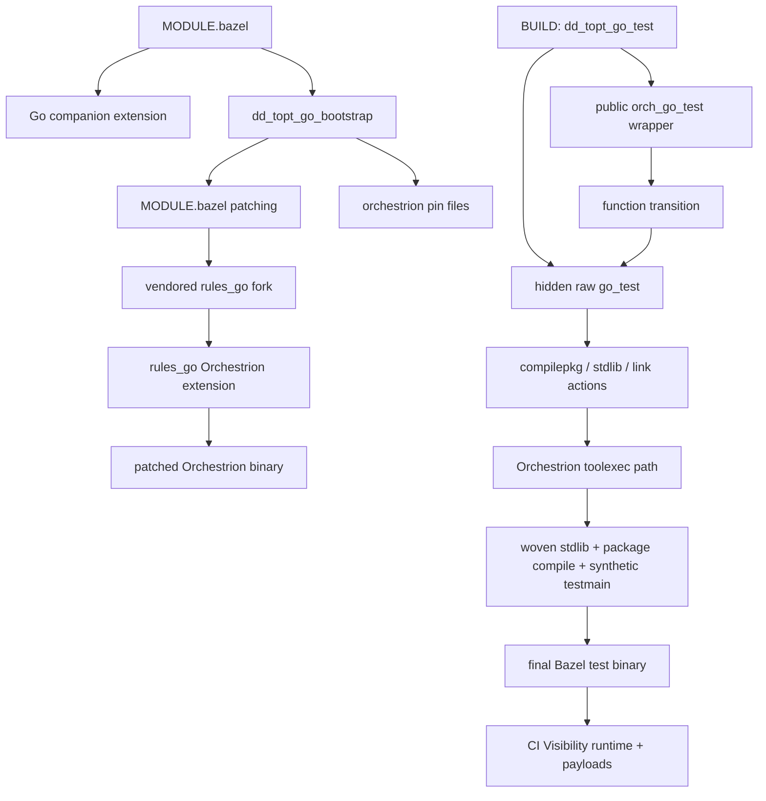
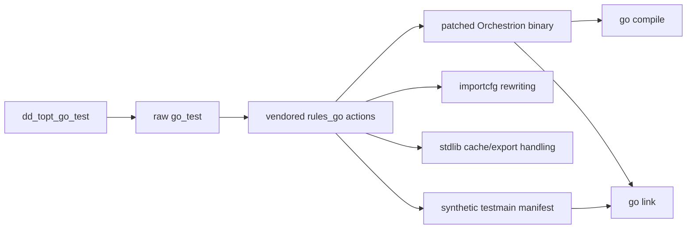
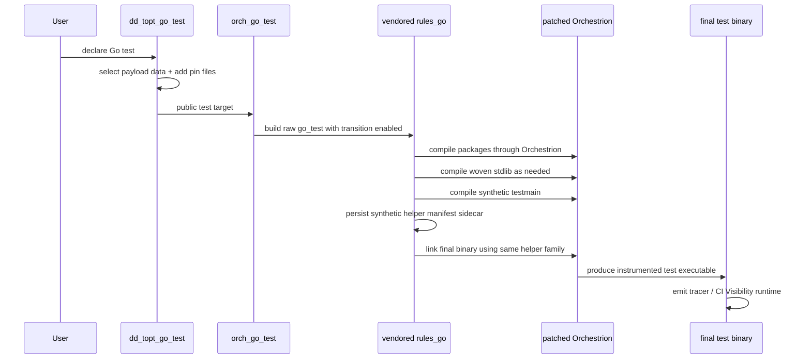

# Go + Orchestrion + Bazel Deep Dive

## Purpose

This document explains the Go instrumentation path as it exists today in this
repository.

It focuses on the current steady-state design:

- how `dd_topt_go_test` is exposed to users
- how bootstrap wires a workspace for Orchestrion
- how the vendored `rules_go` fork invokes Orchestrion under Bazel
- how stdlib weaving, synthetic `testmain`, and final link stay consistent
- which invariants matter if you need to maintain or extend this path

This is a maintainer document. It intentionally describes the current system,
not the debugging history that produced it.

### Why This Section Exists

The Go integration is split across bootstrap, Starlark, vendored `rules_go`,
and patched Orchestrion source. This section states upfront that the document is
meant to unify those pieces into one operational model.

## Scope

The Go integration spans four layers:

1. User-facing macro and analysis-time selection
2. Bootstrap and workspace wiring
3. Vendored `rules_go` fork with Orchestrion support
4. Datadog Orchestrion itself, built from patched source

Primary implementation entry points:

- [modules/go/topt_go_test.bzl](/Users/tony.redondo/repos/github/Datadog/rules_test_optimization/modules/go/topt_go_test.bzl)
- [modules/go/topt_go_orchestrion.bzl](/Users/tony.redondo/repos/github/Datadog/rules_test_optimization/modules/go/topt_go_orchestrion.bzl)
- [modules/go/tools/dd_topt_go_bootstrap/main.go](/Users/tony.redondo/repos/github/Datadog/rules_test_optimization/modules/go/tools/dd_topt_go_bootstrap/main.go)
- [third_party/rules_go_orchestrion/go/private/orchestrion/extensions.bzl](/Users/tony.redondo/repos/github/Datadog/rules_test_optimization/third_party/rules_go_orchestrion/go/private/orchestrion/extensions.bzl)
- [third_party/rules_go_orchestrion/go/private/actions/archive.bzl](/Users/tony.redondo/repos/github/Datadog/rules_test_optimization/third_party/rules_go_orchestrion/go/private/actions/archive.bzl)
- [third_party/rules_go_orchestrion/go/private/actions/compilepkg.bzl](/Users/tony.redondo/repos/github/Datadog/rules_test_optimization/third_party/rules_go_orchestrion/go/private/actions/compilepkg.bzl)
- [third_party/rules_go_orchestrion/go/private/actions/link.bzl](/Users/tony.redondo/repos/github/Datadog/rules_test_optimization/third_party/rules_go_orchestrion/go/private/actions/link.bzl)
- [third_party/rules_go_orchestrion/go/tools/builders/compilepkg.go](/Users/tony.redondo/repos/github/Datadog/rules_test_optimization/third_party/rules_go_orchestrion/go/tools/builders/compilepkg.go)
- [third_party/rules_go_orchestrion/go/tools/builders/importcfg.go](/Users/tony.redondo/repos/github/Datadog/rules_test_optimization/third_party/rules_go_orchestrion/go/tools/builders/importcfg.go)
- [third_party/rules_go_orchestrion/go/tools/builders/link.go](/Users/tony.redondo/repos/github/Datadog/rules_test_optimization/third_party/rules_go_orchestrion/go/tools/builders/link.go)
- [third_party/rules_go_orchestrion/go/tools/builders/orchestrion.go](/Users/tony.redondo/repos/github/Datadog/rules_test_optimization/third_party/rules_go_orchestrion/go/tools/builders/orchestrion.go)

### Why This Section Exists

The repository is broader than the Go integration path. This section narrows
the document to the files that actually determine how Orchestrion-backed Go
tests work.

## Mental Model

The system is easiest to understand as three concentric layers:

- Bazel remains the outer build and test system.
- `rules_go` remains the Go rule implementation, but we vendor a fork that knows
  how to invoke Orchestrion coherently.
- Orchestrion remains the inner compile-time instrumentation engine.

The user still writes a Bazel-native target:

```bzl
dd_topt_go_test(
    name = "pkg_test",
    srcs = ["*_test.go"],
    topt_data = topt_data,
)
```

But the raw `go_test` is built under a transition that enables Orchestrion in
the vendored toolchain.

### Why This Section Exists

The most common architectural mistake is to think of Orchestrion as an external
post-processing step. This section sets the correct model: Bazel, vendored
`rules_go`, and Orchestrion are one compile pipeline.

## High-Level Architecture



### Why This Section Exists

The rest of the document is easier to follow if the major boundaries are visible
first. This diagram is the system map the later sections zoom into.

## Current User-Facing Flow

### Why This Section Exists

The public API is intentionally simpler than the internal implementation. This
section explains the supported user-facing contract before moving into toolchain
mechanics.

### 1. Module setup

The consumer adds:

- the core module
- the Go companion module
- `rules_go`
- the Go companion extension repo

In the current supported Go path, the consumer uses
`test_optimization_go_extension`, which materializes the metadata repo used by
`dd_topt_go_test`.

- In guided single-service setup, bootstrap writes the managed
  `test_optimization_go_extension` block and `use_repo(...)` call.
- In manual single-service or multi-service setup, the same Go extension still
  owns creation of the `test_optimization_data...` repositories.

The generated metadata repo then provides the per-service and per-module
payload labels consumed by `dd_topt_go_test`.

#### Why This Exists

Analysis-time payload selection depends on repository-level metadata. Module
setup creates the repos and exports the macro needs later.

### 2. Bootstrap

The bootstrap binary is the one-time workspace mutation step.

Implementation:
- [main.go](/Users/tony.redondo/repos/github/Datadog/rules_test_optimization/modules/go/tools/dd_topt_go_bootstrap/main.go)

Bootstrap does four things that matter for the current architecture:

1. Ensures `MODULE.bazel` contains `bazel_dep(name = "rules_go", version = "0.59.0")`
2. Writes a managed `git_override` for `rules_go` pointing back to this repo
   with `strip_prefix = "third_party/rules_go_orchestrion"`
3. Enables the `@rules_go//go:extensions.bzl` Orchestrion extension and
   `use_repo(orchestrion, "rules_go_orchestrion_tool")`
4. Runs `orchestrion pin` in the Go module and ensures:
   - `go.mod`
   - `go.sum`
   - `orchestrion.tool.go`
   - `orchestrion.yml`

The important point is that bootstrap does not merely install an external tool.
It aligns:

- Bazel module wiring
- the vendored `rules_go` fork
- the Orchestrion source repo
- the pinned Go module files that Orchestrion expects

#### Why This Exists

Bootstrap centralizes the one-time mutations needed to make Bazel and
Orchestrion agree on the workspace shape. Without that central step, each test
target would need to carry fragile setup knowledge.

### 3. Test macro expansion

`dd_topt_go_test` is the public macro surface.

Implementation:
- [topt_go_test.bzl](/Users/tony.redondo/repos/github/Datadog/rules_test_optimization/modules/go/topt_go_test.bzl)

The macro does three distinct jobs:

1. Select Datadog payload data
2. Prepare runtime env/data wiring for Test Optimization
3. Route the compile through Orchestrion

The macro expands into:

- a hidden raw `go_test`
- a public `orch_go_test` wrapper

When present in the current Bazel package, the raw `go_test` stages the local
Orchestrion pin files as hidden data:

- `go.mod`
- `go.sum`
- `orchestrion.tool.go`
- `orchestrion.yml`

The macro discovers them with a package-local glob, so this is automatic for
packages that contain those files, but it is not a cross-workspace guarantee
for arbitrary subpackages.

That keeps typical module-root packages simple without implying that every Go
test target in every package automatically receives those files.

#### Why This Exists

The macro is the policy boundary. It keeps user BUILD files simple while
combining payload selection, runtime wiring, and Orchestrion-enabled compilation
in one place.

### 4. Transitioned wrapper rule

Implementation:
- [topt_go_orchestrion.bzl](/Users/tony.redondo/repos/github/Datadog/rules_test_optimization/modules/go/topt_go_orchestrion.bzl)

The wrapper rule exists for one reason: it applies a function transition that
sets:

```bzl
"@rules_go//go/private/orchestrion:enabled": True
```

The wrapper then symlinks the executable produced by the raw target and returns
the same runfiles.

This preserves normal Bazel test ergonomics while moving the actual build onto
an Orchestrion-enabled configuration.

#### Why This Exists

The transition wrapper lets the raw test build under a different configuration
without changing the public target shape that users and CI interact with.

## Why the Vendored `rules_go` Fork Exists

Orchestrion is fundamentally a `toolexec`-style integration. In a plain Go
workflow, the intended shape is conceptually:

```text
go test -toolexec="orchestrion toolexec"
```

`rules_go` does not expose a single public seam that means "attach this
toolexec everywhere and preserve normal Go behavior". Under Bazel, the Go
pipeline is decomposed into builder actions:

- stdlib list and stdlib build
- package compilation
- synthetic `testmain` generation and compile
- final link

For Orchestrion to behave correctly, all of those steps must agree on:

- module context
- GOROOT and SDK layout
- importcfg contents
- Datadog helper packagefiles
- stdlib export family
- synthetic test binary link inputs

That is why the repository vendors a `rules_go` fork instead of trying to bolt
Orchestrion on as an external wrapper.

### Why This Section Exists

The vendored fork is the key architectural decision. If a maintainer does not
understand why it exists, they will naturally try to simplify the wrong layer.

## Current Toolchain Topology



### Why This Section Exists

This is the toolchain-only view of the system. It highlights where state is
carried between compile and link, which is the part most maintainers need to
reason about when something breaks.

## Vendored `rules_go`: What It Owns

The vendored fork owns the Orchestrion integration at the action and builder
layer.

### Why This Section Exists

The fork is not just a copy of upstream `rules_go`; it is the layer that makes
the Bazel pipeline and Orchestrion pipeline behave coherently.

### Starlark action layer

- [archive.bzl](/Users/tony.redondo/repos/github/Datadog/rules_test_optimization/third_party/rules_go_orchestrion/go/private/actions/archive.bzl)
- [compilepkg.bzl](/Users/tony.redondo/repos/github/Datadog/rules_test_optimization/third_party/rules_go_orchestrion/go/private/actions/compilepkg.bzl)
- [link.bzl](/Users/tony.redondo/repos/github/Datadog/rules_test_optimization/third_party/rules_go_orchestrion/go/private/actions/link.bzl)

Responsibilities:

- declare the outputs needed by Orchestrion-aware compile and link steps
- pass the Orchestrion binary into builders
- pass the synthetic `testmain` manifest sidecar through analysis and execution

#### Why This Exists

Starlark is where Bazel decides which files and arguments are real. If the
manifest sidecar or Orchestrion tool are not declared here, the builders cannot
use them later.

### Builder layer

- [compilepkg.go](/Users/tony.redondo/repos/github/Datadog/rules_test_optimization/third_party/rules_go_orchestrion/go/tools/builders/compilepkg.go)
- [importcfg.go](/Users/tony.redondo/repos/github/Datadog/rules_test_optimization/third_party/rules_go_orchestrion/go/tools/builders/importcfg.go)
- [link.go](/Users/tony.redondo/repos/github/Datadog/rules_test_optimization/third_party/rules_go_orchestrion/go/tools/builders/link.go)
- [orchestrion.go](/Users/tony.redondo/repos/github/Datadog/rules_test_optimization/third_party/rules_go_orchestrion/go/tools/builders/orchestrion.go)
- [stdlib.go](/Users/tony.redondo/repos/github/Datadog/rules_test_optimization/third_party/rules_go_orchestrion/go/tools/builders/stdlib.go)
- [stdliblist.go](/Users/tony.redondo/repos/github/Datadog/rules_test_optimization/third_party/rules_go_orchestrion/go/tools/builders/stdliblist.go)

Responsibilities:

- prepare a safe Go module environment for Orchestrion
- normalize GOROOT and SDK behavior in Bazel sandboxes
- rewrite importcfg so woven stdlib and Datadog helper packages are resolvable
- persist synthetic `testmain` helper selections across compile and link
- ensure final link reuses the same helper export family chosen during compile

#### Why This Exists

Execution-time coherence cannot be solved in analysis alone. The builder layer
is where the environment, importcfg, and archive family are made consistent.

## Patched Orchestrion Source

The vendored `rules_go` fork does not use upstream Orchestrion unchanged.

Implementation:
- [extensions.bzl](/Users/tony.redondo/repos/github/Datadog/rules_test_optimization/third_party/rules_go_orchestrion/go/private/orchestrion/extensions.bzl)

The Orchestrion repository rule downloads Orchestrion source and patches it
before building the binary. The patches fall into a few categories:

### Resolver and tempdir compatibility

Orchestrion sometimes shells out to `go list` while resolving injectors and
package files. Under Bazel, that has to work in a synthetic module layout and
inside sandboxes.

The patches make dependency resolution less recursive and more Bazel-friendly,
and they create compatibility symlinks in temporary work directories where
needed.

#### Why This Exists

Upstream Orchestrion expects a more conventional Go execution environment than
Bazel provides. These patches adapt resolver behavior to Bazel sandboxes and
synthetic work directories.

### Compile proxy and archive metadata support

The compile proxy is patched so it can correctly understand linker-object
outputs and cooperate with the synthetic `testmain` flow.

#### Why This Exists

The synthetic `testmain` path needs metadata to survive across Bazel's separate
compile and link stages. The compile proxy has to preserve that information.

### Resolver-context patches

The `oncompile`, `oncompile-main`, and `onlink` hooks are patched so dependency
lookups run with the Bazel-specific import-path context they actually need, not
only with upstream assumptions about a normal Go tool invocation.

#### Why This Exists

Under Bazel, package identity can differ from what upstream Orchestrion would
infer from a normal `go` command. These patches keep lookup context aligned with
the package Bazel is actually compiling.

### Injector prefilter and stdlib lookup behavior

Some patches keep Orchestrion from dropping required aspects too early or
failing to discover stdlib archives when Bazel's importcfg layout differs from
what upstream Orchestrion normally sees.

#### Why This Exists

If Orchestrion rejects a package too early or cannot locate stdlib archives,
later steps cannot recover. These patches keep the instrumentation path open.

The result is still "Orchestrion from source", but it is a Bazel-adapted build
of Orchestrion, not a stock upstream binary.

### Why This Section Exists

The Orchestrion binary is part of the supported integration surface. This
section explains why the current design depends on a Bazel-adapted Orchestrion
build, not just on the vendored `rules_go` changes.

## The Compile Path

### Why This Section Exists

Compile is where the system first moves from "configured for instrumentation"
to "producing instrumented artifacts". This section explains that boundary.

### Package compile

The compile entry point is:

- [compilepkg.go](/Users/tony.redondo/repos/github/Datadog/rules_test_optimization/third_party/rules_go_orchestrion/go/tools/builders/compilepkg.go)

At compile time, the builder:

1. Parses the normal `rules_go` compile arguments
2. Creates a work directory
3. Prepares a Go module/cache environment for Orchestrion
4. Filters sources and applies cgo/coverage/nogo handling as usual
5. Invokes the Go compiler through Orchestrion when enabled

The key Orchestrion-specific compile responsibilities are:

- module/cache preparation
- importcfg rewriting
- synthetic `testmain` helper capture

#### Why This Exists

Package compile is the first place where wrong module context, wrong importcfg,
or wrong stdlib selection can poison everything downstream.

### Synthetic `testmain`

`rules_go` synthesizes a `testmain.go` package for Go tests. That synthetic
package is special because it is the point where Datadog CI Visibility hooks
around `testing` become visible in the final test binary.

For synthetic `testmain`, compilepkg generates a sidecar manifest:

- logical manifest name inside the workdir: `orchestrion.pack`
- declared Bazel sidecar output: `<archive>.a.orchestrion.pack`

Implementation details:

- [archive.bzl](/Users/tony.redondo/repos/github/Datadog/rules_test_optimization/third_party/rules_go_orchestrion/go/private/actions/archive.bzl)
- [compilepkg.bzl](/Users/tony.redondo/repos/github/Datadog/rules_test_optimization/third_party/rules_go_orchestrion/go/private/actions/compilepkg.bzl)
- [compilepkg.go](/Users/tony.redondo/repos/github/Datadog/rules_test_optimization/third_party/rules_go_orchestrion/go/tools/builders/compilepkg.go)

The sidecar records the compile-time `packagefile` directives for the Datadog
helper packages that synthetic `testmain` was rooted against. That is the
contract between compile and final link.

#### Why This Exists

`testing` instrumentation enters through synthetic `testmain`. The sidecar
exists so final link can reuse the exact helper package family chosen during
compile instead of reconstructing a different one.

## Importcfg Management

The importcfg layer is where the Bazel/Orchestrion integration becomes most
concrete.

Implementation:
- [importcfg.go](/Users/tony.redondo/repos/github/Datadog/rules_test_optimization/third_party/rules_go_orchestrion/go/tools/builders/importcfg.go)

This file owns several distinct jobs:

### Why This Section Exists

Importcfg is the explicit statement of what the toolchain can import. This
section explains how the integration shapes that package universe.

### 1. Stdlib archive resolution

Orchestrion may need the woven stdlib archive family, not just the default one.
The builder can source stdlib packagefiles from:

- normal Bazel stdlib archives
- seeded stdlib cache exports
- persisted stdlib export manifests

#### Why This Exists

Orchestrion can weave stdlib packages, so compile and link need to resolve the
woven stdlib archive family rather than silently falling back to the default
unwoven one.

### 2. Datadog helper package resolution

The Datadog helper packages used for CI Visibility and tracing must exist as
real `packagefile` entries in the importcfg seen by compile and link.

#### Why This Exists

Injected CI Visibility hooks become ordinary package dependencies after weaving.
If their exports are missing from importcfg, the final binary cannot preserve
the instrumentation path.

### 3. Importcfg rewriting

The builder rewrites existing `packagefile` directives and appends missing ones
so the toolchain sees a coherent package universe.

#### Why This Exists

Bazel's default importcfg contents do not fully describe the instrumented build
graph. Rewriting is how the builders present the package set Orchestrion
actually needs.

### 4. Helper-root reuse

The final link must not invent a different Datadog helper export family than
the one synthetic `testmain` compile already used. The importcfg layer is where
that reuse is made explicit.

#### Why This Exists

Compile and link are separate actions. Helper-root reuse is the mechanism that
keeps them inside the same Datadog package universe.

## The Link Path

The link entry point is:

- [link.go](/Users/tony.redondo/repos/github/Datadog/rules_test_optimization/third_party/rules_go_orchestrion/go/tools/builders/link.go)

The link builder has two modes:

- normal Orchestrion-enabled link
- synthetic test binary link

### Why This Section Exists

Link is the last place where separate compile outputs can either converge into a
coherent binary or drift apart. This section explains how the current design
forces convergence.

### Normal link

When linking a normal main package, link can run through Orchestrion directly
and can append the broader Datadog helper closure it needs for the final binary.

#### Why This Exists

Normal link establishes the baseline behavior: link may complete the helper
closure, but it must still stay inside one consistent export family.

### Synthetic test binary link

When linking the Bazel synthetic test binary, the path is more constrained.

`link.go` detects a synthetic test link from the main archive name:

- `~testmain.a`

For synthetic test links it:

1. Reads the synthetic `testmain` sidecar manifest
2. Applies those `packagefile` directives into the link importcfg
3. Reuses the compile-time Datadog helper root
4. Completes the broader Datadog closure from that same root when link itself is
   still Orchestrion-enabled

That is the core consistency rule of the current implementation:

> synthetic `testmain` compile and final link must operate on the same Datadog
> helper export family

Without that, compile may instrument `testing`, but the final linked test binary
may not preserve those hooks coherently.

#### Why This Exists

This is the highest-risk link path because Bazel's synthetic test wrapper and
Datadog's `testing` instrumentation meet here. The sidecar manifest exists to
make that join deterministic.

## The Orchestrion Runtime Environment Inside Builders

Implementation:
- [orchestrion.go](/Users/tony.redondo/repos/github/Datadog/rules_test_optimization/third_party/rules_go_orchestrion/go/tools/builders/orchestrion.go)

This file centralizes the environment preparation Orchestrion needs under Bazel.

Important responsibilities:

### Why This Section Exists

The builders do not run in a normal developer shell. This section explains the
supporting environment that must exist before Orchestrion can do useful work.

### Go cache and module cache provisioning

The builder ensures writable:

- `GOPATH`
- `GOMODCACHE`
- `GOCACHE`

That matters because Orchestrion shells out to Go tooling while resolving
injectors and package files.

#### Why This Exists

Without writable caches and module storage, Orchestrion's internal `go` calls
fail inside Bazel sandboxes even when the outer action is otherwise correct.

### Shared cache reuse

Bootstrap and sandboxed builder steps both use a stable shared cache root:

- `datadog-orchestrion-go-cache`

This lets Orchestrion reuse fetched modules instead of redownloading them for
each sandboxed step.

#### Why This Exists

The shared cache is not just a performance optimization. It keeps bootstrap-time
pinning and sandboxed builder steps working against the same downloaded module
set.

### GOROOT and SDK compatibility

Some Bazel sandboxes expose an SDK layout that differs from what Orchestrion's
subprocesses assume. The builder normalizes that by:

- resolving absolute SDK/GOROOT paths
- creating compatibility symlinks when `GOROOT/src` is missing

#### Why This Exists

Orchestrion and the Go toolchain expect a usable GOROOT layout. Bazel's SDK
presentation can differ enough that the builders need to repair that view.

### Synthetic module preparation

Orchestrion expects a real Go module context. The builder prepares a synthetic
module environment when the Bazel workdir does not already match that shape.

#### Why This Exists

Orchestrion resolves injectors and pinned module files through Go module
semantics. Synthetic module preparation gives it a workspace shape compatible
with those expectations.

### Woven dependency warmup

The builder can probe or warm the dependencies Orchestrion commonly weaves,
especially Datadog tracing and profiling packages.

#### Why This Exists

Some required woven dependencies are first touched inside sandboxed steps.
Warming them reduces failures caused by lazy first access in those contexts.

## End-to-End Flow for a Go Test



### Why This Section Exists

The system crosses many boundaries. This sequence compresses them into one path
so a maintainer can reason from the declared test target to the observed runtime
behavior.

## Runtime Result

At runtime, a correctly wired binary shows evidence that the compile-time path
worked:

- Datadog tracer debug logs can appear when enabled
- CI Visibility hooks around Go `testing` are preserved in the final test binary

Those runtime markers are not produced by the macro alone. They depend on the
compile, synthetic `testmain`, and final link steps all agreeing on the same
instrumented package universe.

Separate from runtime behavior, the builders also use archive-content heuristics
such as `instrumentTestingTFunc` and `instrumentTestingM` while scanning helper
exports during compile/link consistency checks. Those names are useful
build-time indicators, but they are not themselves user-visible runtime
signals.

### Why This Section Exists

The global goal is not just "a successful build". It is a final test binary
whose runtime behavior proves that CI Visibility instrumentation survived the
full Bazel compile and link pipeline.

## Invariants Maintainers Should Preserve

If you change this system, keep these invariants intact.

### Why This Section Exists

This section marks the boundaries of safe refactoring. It separates incidental
implementation details from the properties that actually make the design work.

### 1. The public API stays Bazel-native

Users should keep writing `dd_topt_go_test`, not a custom shell rule or an
alternate test runner.

#### Why This Exists

The integration is meant to feel like normal Bazel usage to consumers. If the
public entry point changes shape, the maintenance burden moves into every
consumer workspace.

### 2. Bootstrap owns workspace mutation

The bootstrap tool is the place that mutates:

- `MODULE.bazel`
- `orchestrion.tool.go`
- `orchestrion.yml`
- pinned Go module files

Do not push that complexity onto each test target.

#### Why This Exists

Workspace mutation has to happen in one place or the setup becomes fragile and
non-idempotent. Bootstrap is that one place.

### 3. Synthetic `testmain` compile and final link must share helper state

The sidecar manifest and helper-root reuse are structural, not optional.

#### Why This Exists

This is the specific invariant that keeps `testing` instrumentation alive in the
final binary. Losing it produces apparently successful builds with incomplete
runtime behavior.

### 4. Importcfg must remain the single place where package universes are made coherent

If compile or link needs a packagefile and it is not in importcfg, that is an
importcfg problem first.

#### Why This Exists

Putting package-universe fixes in multiple places makes the pipeline impossible
to reason about. Importcfg must remain the primary source of truth.

### 5. Orchestrion must run in a real-enough Go module context

Builder-side synthetic module and cache preparation are not cosmetic. They are
required because Orchestrion shells out to Go tooling internally.

#### Why This Exists

If Orchestrion cannot see a usable Go module environment, it stops behaving like
the tool this design expects and starts failing in ways that look unrelated to
the actual instrumentation logic.

### 6. The Orchestrion binary is part of the integration surface

The source patches in `extensions.bzl` are part of the supported design. Treat
them as first-class integration code, not as temporary local hacks.

#### Why This Exists

The vendored `rules_go` changes alone are not enough. The built Orchestrion
binary carries Bazel-specific behavior that the rest of the design relies on.

## Practical Debugging Map

When something breaks, this is the fastest place to look.

### Why This Section Exists

The implementation surface is large. This section shortens the feedback loop by
mapping likely failure classes to the files that actually control them.

### Bootstrap and workspace shape

- [main.go](/Users/tony.redondo/repos/github/Datadog/rules_test_optimization/modules/go/tools/dd_topt_go_bootstrap/main.go)

Look here if:

- `MODULE.bazel` wiring is wrong
- `rules_go_orchestrion_tool` is missing
- `orchestrion.tool.go` was not pinned

#### Why This Exists

Many failures that look like compile bugs are really workspace-shape bugs. This
section makes that distinction explicit.

### Macro and transition behavior

- [topt_go_test.bzl](/Users/tony.redondo/repos/github/Datadog/rules_test_optimization/modules/go/topt_go_test.bzl)
- [topt_go_orchestrion.bzl](/Users/tony.redondo/repos/github/Datadog/rules_test_optimization/modules/go/topt_go_orchestrion.bzl)

Look here if:

- the wrapper target is not enabling Orchestrion
- runfiles or executable naming are wrong
- payload data selection is wrong

#### Why This Exists

This is the place to debug analysis-time mistakes before looking at builder
internals. If the wrong target graph is produced, the toolchain never gets a
chance to do the right thing.

### Orchestrion source patching

- [extensions.bzl](/Users/tony.redondo/repos/github/Datadog/rules_test_optimization/third_party/rules_go_orchestrion/go/private/orchestrion/extensions.bzl)

Look here if:

- the Orchestrion tool fails during resolver or injector setup
- dependency resolution differs from local `go` behavior
- patched upstream assumptions drift

#### Why This Exists

Some failures originate inside the generated Orchestrion binary, not inside
Starlark or the builders. This section points directly at that integration seam.

### Compile/link consistency

- [compilepkg.go](/Users/tony.redondo/repos/github/Datadog/rules_test_optimization/third_party/rules_go_orchestrion/go/tools/builders/compilepkg.go)
- [importcfg.go](/Users/tony.redondo/repos/github/Datadog/rules_test_optimization/third_party/rules_go_orchestrion/go/tools/builders/importcfg.go)
- [link.go](/Users/tony.redondo/repos/github/Datadog/rules_test_optimization/third_party/rules_go_orchestrion/go/tools/builders/link.go)

Look here if:

- stdlib weaving appears missing
- Datadog helper packages are unresolved
- synthetic test binaries lose instrumentation at final link

#### Why This Exists

Most correctness bugs eventually reduce to compile/link inconsistency. This is
the fastest entry point for the class of bugs that most directly threaten the
global goal.

## Summary

The current architecture is:

- a Bazel-native public Go test macro
- a bootstrap step that wires the workspace once
- a vendored `rules_go` fork that integrates Orchestrion at the builder layer
- a patched Orchestrion binary built from source
- a synthetic `testmain` manifest contract that keeps compile and final link in
  the same Datadog helper package universe

That combination is what makes the current Go CI Visibility path work under
Bazel while still behaving like a normal `go_test` target from the user's point
of view.

### Why This Section Exists

The final summary compresses the design down to the few moving pieces that are
actually carrying the integration. If a future simplification preserves these
properties, it is likely safe.
