# Go Orchestrion Maintainer State

## Purpose

This document is the maintainer-facing summary of the current Go + Orchestrion
integration as it exists in this repository after the recent performance work.

Use it when you need one place that answers:

- how the integration is wired end to end
- why the fork exists and what it changes
- why the system still rebuilds Orchestrion on a true cold start
- which performance optimizations were kept
- which experiments failed and why
- what the next useful optimization directions are

This is intentionally different from the other Go Orchestrion docs:

- [go_orchestrion_bazel_deep_dive.md](./go_orchestrion_bazel_deep_dive.md)
  explains the steady-state architecture in detail
- [rules_go_orchestrion_performance_analysis.md](./rules_go_orchestrion_performance_analysis.md)
  is the earlier code-reading analysis
- [rules_go_orchestrion_probe_measurements.md](./rules_go_orchestrion_probe_measurements.md)
  is the running measurement log

This document is the current state summary that ties those three views
together.

## Current Architecture In One View

```mermaid
flowchart TD
    A["Consumer BUILD: dd_topt_go_test"] --> B["Hidden raw go_test"]
    A --> C["Test Optimization data repo"]
    B --> D["Vendored rules_go fork"]
    D --> E["compilepkg / stdlib / link builders"]
    E --> F["orchestrion toolexec"]
    F --> G["Patched Orchestrion binary"]
    G --> H["Woven packages and woven stdlib"]
    H --> I["Final Bazel test binary"]
    I --> J["CI Visibility runtime and payload files"]

    K["Bootstrap or manual MODULE wiring"] --> L["rules_go Orchestrion extension"]
    L --> G
    L --> M["dd_trace_go_versions.json"]
    M --> E
```

The important model is:

- Bazel is still the build and test system
- `rules_go` still owns the Go build pipeline
- Orchestrion is not a post-processing step
- the vendored fork makes Orchestrion part of the normal compile, stdlib, and
  link path

## Why The Fork Exists

We are not using upstream `rules_go` and upstream Orchestrion as-is.

The vendored fork exists because the Bazel path needs behavior that upstream
Orchestrion and upstream `rules_go` do not provide together out of the box:

- Bazel-compatible `toolexec` invocation inside sandboxed Go actions
- synthetic `testmain` handling that keeps Datadog helper packages and Bazel's
  generated test binary layout consistent
- woven stdlib archive handling that stays compatible with `importcfg`,
  packagefile resolution, and later link steps
- fallback stdlib and archive lookup behavior when Bazel's archive layout does
  not match Orchestrion's default assumptions
- a bootstrap path that builds a patched Orchestrion binary and exposes its
  version metadata to later builder actions

In short: the fork is not ornamental. It is the compatibility layer that keeps
Orchestrion coherent inside Bazel.

## Why The Orchestrion Tool Is Still Built

On a true cold start, Bazel still builds the Orchestrion binary because:

- the extension downloads Orchestrion source, not a prebuilt binary
- we patch that source for Bazel compatibility before building it
- the resulting binary is platform-specific
- the bootstrap cache is host-local, so a fresh CI runner starts empty

The recent work changed one important part of this story:

- Bazel no longer rewrites Orchestrion's own `go.mod` to force the target
  `dd-trace-go` version into the tool build
- instead, Bazel builds the patched tool from Orchestrion's upstream module
  graph and separately validates the selected Datadog tracer versions against
  the target module through `dd_trace_go_versions.json`

That reduced cold bootstrap cost substantially without changing the target-side
tracer version that the instrumented binary actually loads.

## Why The Target Still Uses The Pinned Tracer Version

This is the subtle point that mattered most in the recent work.

There are two different module contexts:

1. the temporary Orchestrion tool repository that Bazel downloads and builds
2. the target Go module being compiled and tested

The expensive old bootstrap path was rewriting the first one. The runtime
behavior we care about comes from the second one.

The kept design now does this:

- build the patched Orchestrion tool from its own upstream module graph
- write the configured Datadog tracer versions into
  `dd_trace_go_versions.json`
- validate the target module against that version file in the builder path
- let the instrumented target binary load the tracer version pinned by the
  target workspace

That is why runtime validation must show the target workspace's configured
Datadog tracer version, even after tool-side `go.mod` rewriting was removed.

## Kept Performance Changes

These changes were kept because they improved performance without changing
runtime behavior.

### 1. Synthetic helper decision and export caching

Kept in the builder path:

- stable cache keys across fresh Bazel output bases
- a persisted synthetic helper decision graph
- a persisted shared module-export cache

Effect:

- repeated synthetic `testmain` rebuilds stopped paying the full
  `go list -export -deps` cost again
- the synthetic helper cold-miss path became materially cheaper

### 2. Orchestrion bootstrap artifact cache

Kept in the extension path:

- host-side cache for the built Orchestrion binary and
  `dd_trace_go_versions.json`
- stable host-side `GOMODCACHE` and `GOCACHE`

Effect:

- warm bootstrap reuse is now real across fresh Bazel output bases
- warm bootstrap dropped from "rebuild the tool again" to "restore cached
  artifact and continue"

### 3. Removing tool-side Orchestrion module repinning

Kept in the extension path:

- no more `go mod edit -require=...`
- no more unconditional `go mod tidy` in the extension/bootstrap build of the
  downloaded Orchestrion repo
- build the patched tool from Orchestrion's upstream module graph

Effect:

- large cold bootstrap reduction
- no loss of runtime tracer correctness in the target binary

The builder still has its own synthetic-module preparation in some paths. In
particular, stdlib weaving can still run a synthetic-module tidy on the
no-`orchsrc` path. The optimization here was specific to the extension-side
tool bootstrap flow.

### 4. Safer stdlib persistence/sync trimming

Kept in the stdlib path:

- avoid rewriting the Bazel stdlib cache onto itself
- trim redundant cache-sync work where the copied result is already at the
  required location

Effect:

- stdlib action time improved
- no runtime regression was observed in the validated kept version

## Experiments That Failed

These failed experiments are worth documenting because they are tempting to try
again.

### 1. Host-side woven stdlib snapshot cache

Why it looked promising:

- it improved build timings
- it reduced repeated stdlib work on paper

Why it was reverted:

- builds still passed
- but runtime weaving was broken
- CI Visibility stopped starting at runtime
- tracer startup logs disappeared
- no payload files were written

Lesson:

- stdlib performance work is not safe to judge by build success alone
- any stdlib optimization must also be validated with tracer startup and
  payload-file output

### 2. Hardlink-based stdlib archive persistence

Why it looked promising:

- it reduced local copy overhead

Why it was reverted:

- GitHub runners hit permission errors when later cache-seeding logic tried to
  rewrite those files

Lesson:

- local filesystem behavior is not enough to validate stdlib cache changes
- hosted CI runners expose permission behavior that local macOS runs may not

### 3. Manifest-only or partial stdlib reuse

Why it looked promising:

- the visible rooted stdlib package set is small

Why it failed:

- later compile and link paths still require a valid cache-local stdlib closure
- the true closure is much larger than the visible root package list
- manifest-only reuse and partial reseeding broke later cache-local reads

Lesson:

- the stdlib path needs more than "archives somewhere on disk"
- it needs a coherent cache-local archive family for a larger dependency
  closure

### 4. Compile-time stdlib seed narrowing

Why it looked promising:

- the fixed stdlib seed looked broader than some compile actions might need

Why it was rejected:

- the safe narrowed experiment was runtime-correct
- but it made the build materially slower in A/B comparison

Lesson:

- the current broader seed is not obviously accidental
- narrowing it shifts work around in ways that can make the full build worse

### 5. Narrowing the stdlib root package build set

Why it looked promising:

- `cmd/internal/cov` and `cmd/internal/bio` looked like candidates for
  conditional handling

Why it was rejected:

- the cold build got worse
- the hermetic fixture flow broke locally

Lesson:

- the current stdlib root set is coupled to the real Bazel test flow more than
  the surface comment suggests

## Current Best-Known Baseline

The current baseline should be read in two modes:

- true cold start
- warm bootstrap reuse

### Cold start

Measured in the fixture repo with:

- fresh `--output_base`
- isolated `XDG_CACHE_HOME`
- local override mode

Current cold numbers:

- total build elapsed: `249.053s`
- critical path: `75.20s`
- Orchestrion bootstrap total: `153.057s`
- inside bootstrap:
  - download/extract: `32.066s`
  - tool `go build`: `113.334s`

The main conclusion is simple:

- the largest remaining cold-start cost is still building the patched
  Orchestrion tool from scratch

### Warm bootstrap reuse

Measured with:

- a new `--output_base`
- the same shared cache root

Current warm numbers:

- total build elapsed: `86.281s`
- critical path: `68.91s`
- Orchestrion bootstrap total: `3.955s`

The main conclusion is:

- once the bootstrap artifact cache hits, the tool bootstrap is no longer the
  main problem
- stdlib becomes the most visible remaining build step

### Runtime correctness validation

Measured with:

- `DD_TRACE_DEBUG=1`
- `DD_CIVISIBILITY_ENABLED=1`
- a fresh test execution

What must be verified:

- tracer startup logs are present
- CI Visibility initializes
- the test binary reports the target workspace's configured Datadog tracer
  version
- a payload JSON file is written under `test.outputs/payloads/tests`

This validation is part of the baseline, not optional extra checking.

## What Still Looks Expensive

### 1. Cold Orchestrion tool build

This is still the largest single cost on a true cold start.

At this point, the likely remaining wins here are more architectural than
incremental:

- prebuilt patched binaries
- a maintained Bazel-compatible Orchestrion fork
- cross-runner artifact reuse beyond the current host-local cache

### 2. Real stdlib build work

Once bootstrap is warm, stdlib is still substantial.

The remaining stdlib cost now appears to be mostly real work:

- real woven stdlib build time
- real archive persistence and cache-local synchronization that later steps
  still depend on

The easy cache tricks have mostly been exhausted or disproved.

## Recommended Next Steps

### If the goal is the biggest remaining performance win

Go back to the Orchestrion bootstrap problem.

The best remaining options are:

1. publish prebuilt patched Orchestrion binaries
2. maintain a Bazel-compatible Orchestrion fork and distribute binaries from
   it
3. upstream enough Bazel support to shrink the patch surface, then distribute
   a stable patched binary artifact

### If the goal is to keep iterating locally without a larger architectural move

Stay on stdlib, but only with very careful validation.

The most plausible local direction is:

- understand whether the real stdlib build mode can be reduced safely
- do not assume cache-layout tricks are safe
- keep validating runtime behavior, not just build success

## Validation Checklist For Future Changes

Future changes in this area should not be considered done until they pass all
of these checks:

1. focused builder tests in this repo
2. relevant vendored Starlark tests in this repo
3. consumer validation in `../rules_test_optimization_tests`
4. runtime validation with:
   - `DD_TRACE_DEBUG=1`
   - `DD_CIVISIBILITY_ENABLED=1`
5. confirmation that:
   - tracer startup logs are present
   - the pinned tracer version is the one loaded at runtime
   - a payload file is written under `test.outputs/payloads/tests`

That final runtime check is the one that caught the bad stdlib snapshot idea.
