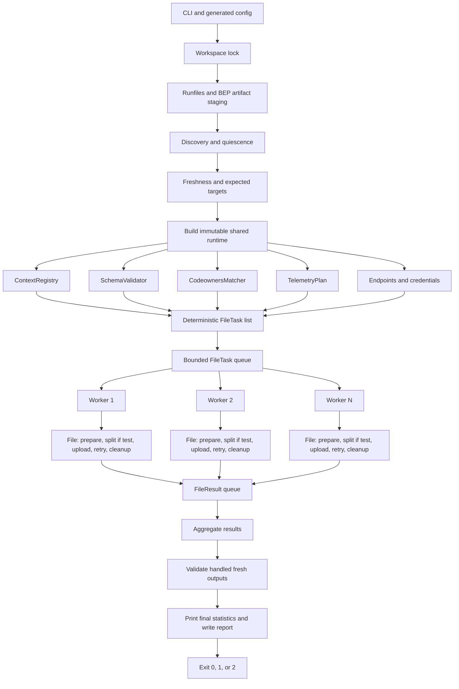

<!--
Unless explicitly stated otherwise all files in this repository are licensed under
the Apache 2.0 License.

This product includes software developed at Datadog
(https://www.datadoghq.com/) Copyright 2025-Present Datadog, Inc.
-->

# Python Parallel Uploader Migration Plan

## Status

- Document status: implementation guide and tracker.
- Implementation status: Python vertical and opt-in rollout target implemented on
  `feature/python-parallel-uploader`, based on `origin/main` at `4850d27`.
- Commit classification: implementation milestone, not completed migration. The
  unchecked compatibility, cross-platform, consumer, documentation, default
  switch, and legacy-removal items below remain release gates.
- Scope: replace the Bash and PowerShell uploader runtimes with one
  cross-platform Python runtime and add bounded file-level concurrency.
- Compatibility target: Linux, macOS, and Windows.
- Guiding rule: prefer the smallest design that satisfies the current uploader
  contract and can be tested thoroughly. Do not add speculative abstractions or
  tuning controls.

Current checkpoint:

- the Python runtime is wired into the Bazel uploader rule behind the temporary
  `use_python_uploader = True` rollout switch. The legacy runtime remains the
  default until the cross-platform and consumer parity gates pass;
- the direct Python entrypoint now runs the complete preflight, worker,
  postflight, and reporting vertical;
- the minimal bootstrap, immutable task/result models, fixed payload limit,
  typed configuration, endpoint resolution, redacted logging, and owned
  temporary-directory primitives have initial unit coverage;
- runfiles state is now snapshotted once into an immutable resolver supporting
  direct paths, directory runfiles, launcher-adjacent runfiles, Bzlmod path
  variants, and manifest-only paths containing spaces;
- workspace-scoped locking now has a dependency-free Python implementation:
  atomic directory plus PID metadata on Unix and a held byte-range file lock on
  Windows. A small Unix advisory guard serializes Python acquisition, stale
  reclamation, and release so one contender cannot delete a newly acquired
  lock. Cleanup is owner-only, and stale Unix cleanup refuses to recursively
  delete unexpected lock contents;
- schema validation now exposes a structured, per-call Python API. One loaded
  schema can be shared by workers while each validation keeps independent
  errors, warnings, and counters; the existing validator CLI remains intact;
- a standard-library HTTP transport now implements the normalized
  four-attempt retry policy, terminal `413`/permanent `4xx`, `Retry-After`,
  separate connect and socket-I/O timeouts, bounded response diagnostics,
  system TLS verification, snapshotted proxy/`NO_PROXY` settings, gzip, and
  replayable exact-length JSON/multipart bodies. Its local macOS compatibility
  spike passes; HTTPS handshakes and Linux/Windows lanes remain open gates;
- CODEOWNERS discovery and parsing now produce one immutable matcher before
  worker startup. It preserves current discovery order, last-match-wins,
  explicit empty-owner rules, source candidate normalization, producer-owned
  tags, and span filtering; concurrent workers only read the compiled rules;
- the worker pool uses a bounded queue and homogeneous
  non-daemon workers. Each thread owns one reusable transport, processes one
  file through one complete processor call, emits one immutable result, and
  cannot mutate coordinator counters;
- pure per-file enrichment now selects zero/one/multiple bundled contexts,
  normalizes the allowed top-level metadata sections, merges context then Bazel
  sidecar values into event tags/metrics, filters the API-key fingerprint, and
  invokes CODEOWNERS last. Multi-context misses are warning outcomes;
- one homogeneous file processor dispatches test, coverage, and
  telemetry sources. A test worker reads, enriches, warning-validates, splits,
  gzips each prepared chunk when enabled, sends its chunks sequentially, and
  cleans the source only after complete success. Coverage uses the fixed
  multipart protocol and JSON/msgpack media types;
- immutable telemetry planning now correlates facts with tracer streams before
  worker startup but emits only per-source directives. The anchor worker owns
  primary and synthetic preparation, sends them sequentially, and retains the
  anchor if either request fails;
- every primary telemetry body is now materialized in the owning worker's
  task-local directory. Unchanged payloads preserve their exact source bytes,
  while augmented payloads use the deterministic compact serialization; every
  retry therefore reopens the same immutable body and `Content-Length` remains
  consistent even if the original source changes;
- dry-run now follows those same per-type preparation paths, including expected
  enrichment-tag checks, preventive splitting, gzip preparation, telemetry
  augmentation, and the upload path's URL/header/body-size request validation,
  then stops before HTTP and source cleanup;
- the deterministic compact-JSON splitter is connected to the worker path and
  has exact `limit-1`, `limit`, and `limit+1` byte fixtures;
- deterministic local/staged discovery now creates one stable `FileTask` per
  direct JSON/msgpack source, preserves staged-output precedence, supports the
  maximum-depth and quiescence contracts, and never reads payload bodies while
  scheduling;
- context manifests, runtime overrides, telemetry-facts manifests, and schema
  are resolved through one immutable runfiles snapshot before workers start;
- expected-target association accepts only the target's exact `test.outputs`
  path or Bazel's recognized shard/run/attempt directory suffixes. A target can
  no longer claim an unrelated nested target through a simple path prefix;
- unreadable runfiles manifests now produce a controlled exit-code-2 diagnostic
  instead of escaping the bootstrap as a traceback;
- a coordinator vertical now constructs CODEOWNERS and telemetry plans once,
  runs mixed test/coverage/telemetry tasks through the real bounded pool, and
  aggregates immutable results. One aggregate renders both the mandatory human
  statistics and its JSON statistics model;
- the fetch-time API-key fingerprint check now runs once before worker startup,
  preserves the legacy warning-only mismatch/EVP behavior, and never logs the
  key or either fingerprint value;
- worker-pool interruption now drains unowned work, joins every active worker,
  preserves completed immutable results, records cancelled files, emits the
  normal human/JSON report, cleans owned resources, and exits with `130`.
  Interrupts during worker startup and after normal sentinels have already been
  consumed cannot leave non-daemon threads or unconsumed queue entries behind;
- task and invocation temporary cleanup failures are warning outcomes. They no
  longer replace a successful upload result or invite a duplicate send;
- a BEP staging cleanup failure preserves every completed file/request counter
  and adds its own warning/reason instead of replacing the aggregate with an
  empty report;
- debug mode now covers redacted effective configuration, runfiles/freshness,
  CODEOWNERS/context selection, queue and worker lifecycle, exact payload/chunk
  sizes, task-scoped HTTP attempts/retries/status, cleanup, and final timing;
- a real loopback harness now proves that `workers=1` can send test JSON,
  coverage multipart, and telemetry through the same worker implementation;
- the Bazel rule now accepts `workers`, generates the typed Python config JSON,
  and carries the complete Python runtime in runfiles;
- small Bash and PowerShell launchers resolve the configured host Python,
  `uploader_main.py`, and generated config only. Unix directory and
  manifest-only runfiles, including paths with spaces, are covered;
- preflight now reuses the doctor Python runtime for BEP parsing and artifact
  staging, parses execution-log freshness without `jq`, validates expected
  targets, applies staged-over-local precedence, and cleans owned staging roots;
- the legacy Bash and PowerShell launchers remain the default behavior only for
  the rollout comparison window.

Validation checkpoint (`2026-08-28`, macOS arm64):

- `python3 -m unittest discover -s tools/tests/python -p 'test*_tools.py'`:
  434 tests executed; 433 pass and one platform-specific test is skipped on
  macOS with ShellCheck and PowerShell installed;
- `./bazelw test //tools/tests/core:tests
  //tools/tests/python:python_tools_test
  --noexperimental_split_xml_generation`: 166 targets pass;
- `python3 tools/dev/lint_uploader_templates.py` passes with ShellCheck 0.11.0
  and PowerShell 7.6.5, and `buildifier -mode=check` passes for every modified
  Starlark and BUILD file;
- `bazel run` of the opt-in generated Python uploader succeeds in debug
  dry-run mode using its real runfiles;
- a real threaded loopback HTTP test proves request overlap with four workers,
  while the observed peak never exceeds the configured bound;
- `workers=1` sends all three protocols through the real standard-library HTTP
  transport and deletes each source only after its request succeeds;
- the repository integration harness now runs the generated opt-in Bazel
  target against its real loopback backend: three workers successfully send a
  test, coverage, and telemetry source to their three protocol endpoints and
  emit the mandatory final statistics;
- the Go, Python, Java, NodeJS, .NET, and Ruby companion suites pass locally
  with the core module overridden to this branch;
- the broader `//tools/... //examples/...` matrix reaches 200/200 passing test
  targets, but the aggregate build remains blocked by an unrelated local JDK
  25 versus remote JDK 21 toolchain mismatch in the Java example. A raw
  repository-wide `//...` invocation is independently blocked by the tracked
  `third_party/rgo/v0_62_0/base` package layout already present on `origin/main`.
  The split-XML flag above is the repository-documented workaround for the
  Bazel 8.5.1 macOS split-XML helper crash;
- the sibling consumer fixture resolves this checkout with a local module
  override, but its repository sync requires a real `DD_API_KEY`; that
  cross-repository gate remains open rather than inventing credentials or
  contacting the backend during local validation.

## Objective

Replace the duplicated uploader behavior in
`tools/core/uploader_bash_runtime.sh.tpl` and
`tools/core/uploader_powershell_runtime.ps1.tpl` with one Python
implementation.

The Python uploader must:

- preserve current discovery, freshness, enrichment, upload, cleanup, report,
  and exit-code behavior except where a decision in this document explicitly
  defines an intentional migration change;
- process multiple payload files concurrently through a bounded pool of
  homogeneous workers;
- let each worker own one file from start to finish;
- let every worker dispatch test, coverage, and telemetry payloads;
- prepare CODEOWNERS, contexts, schema, and global telemetry information once
  before starting workers;
- split enriched test payloads before upload when their serialized body exceeds
  the fixed conservative 4.5 MiB (`4_718_592` bytes) threshold;
- never use a failing HTTP request as the normal signal to split a payload;
- always print a compact, deterministic final statistics summary after every
  controlled upload or dry-run execution;
- provide a `--debug` mode with verbose operational diagnostics for preflight,
  worker processing, splitting, retries, and cleanup;
- provide a `--dry-run` mode that executes discovery, freshness, enrichment,
  validation, splitting, and request planning without contacting the backend
  or deleting payloads;
- remain dependency-free outside the Python standard library;
- include unit, integration, cross-platform, and regression tests for every
  migrated behavior.

## Why Python Is Acceptable Here

The recommended workflow already has a runtime dependency on host Python:

- the doctor is a Python runtime launched through generated Unix and Windows
  entrypoints;
- recommended BEP artifact staging requires Python;
- schema validation, support-bundle generation, and parts of the current Unix
  telemetry path already use Python.

This does not mean that the core module currently provides a Python toolchain to
all consumers. Root `rules_python` is a dev-only dependency. The migrated
uploader must therefore:

- resolve a host interpreter explicitly;
- fail with exit code `2` and an actionable message when it is unavailable;
- require Python 3.10 or newer, matching syntax already used by the doctor;
- use only the standard library in the first implementation;
- not add a public core dependency on `rules_python`.

Interpreter resolution must be consistent on Unix and Windows:

1. `DD_TEST_OPTIMIZATION_PYTHON`;
2. `PYTHON`;
3. `python3`;
4. `python`.

The CI wrappers should eventually resolve the interpreter once and pass the
same value to doctor and uploader.

## Current Baseline

The current uploader consists of two large independent runtimes:

- Bash/curl/jq/gzip on Unix and macOS;
- PowerShell/.NET `HttpClient` on Windows.

Both runtimes implement variants of:

- runfiles and artifact resolution;
- CLI and environment parsing;
- workspace locking;
- local and BEP-staged payload discovery;
- quiescence waiting;
- BEP and execution-log freshness filtering;
- expected-target validation;
- context selection;
- Bazel sidecar enrichment;
- CODEOWNERS detection, parsing, matching, and enrichment;
- schema validation;
- test, coverage, and telemetry upload protocols;
- telemetry facts augmentation;
- gzip and multipart handling;
- retries;
- cleanup;
- diagnostic report generation;
- aggregate exit-code selection.

Uploads are currently performed sequentially by payload type. Large test
payloads are not split by the uploader in this repository.

## Decisions

- **D-1: One Python runtime.** All functional uploader behavior moves to
  Python. Bash and PowerShell remain only as small platform launchers while
  needed by Bazel.
- **D-2: One homogeneous worker pool.** There are no separate enrichment and
  upload pools.
- **D-3: One file per task.** A worker owns a source file for its complete
  lifecycle: read, enrich when applicable, validate, split when applicable,
  upload, retry, cleanup, and return one result.
- **D-4: Every worker supports every payload type.** A worker may process a
  test task, then a coverage task, then a telemetry task.
- **D-5: Shared resources are prepared once.** CODEOWNERS, contexts, schema,
  endpoints, credentials, and telemetry planning are resolved before workers
  start and exposed as immutable runtime state.
- **D-6: CODEOWNERS uses one shared matcher instance.** Detection, parsing,
  normalization, glob conversion, and regex compilation happen once. Worker
  matching is read-only.
- **D-7: Threads are the initial concurrency mechanism.** Threads can share the
  same immutable matcher and runtime instances on every platform, while HTTP
  and filesystem waits provide the principal opportunity for concurrency.
- **D-8: Split is preventive.** The worker measures the enriched serialized
  test body and splits it before the first request when it exceeds the fixed
  conservative limit of 4.5 MiB (`4_718_592` bytes).
- **D-9: No adaptive split on HTTP 413.** A `413` after preventive splitting is
  a terminal upload error indicating configuration or intake-contract drift.
- **D-10: Test payloads are the only split-capable type in v1.** Coverage and
  telemetry files are uploaded independently but are not structurally split.
- **D-11: Chunks from one file are ordered.** A worker sends the chunks from a
  source file sequentially in original event order.
- **D-12: Files are independent.** There is no ordering or barrier between
  different files beyond queue assignment.
- **D-13: Cleanup is file-scoped.** The worker deletes the source only after
  every derived request for that file succeeds and only when keep-payloads is
  disabled.
- **D-14: Results, not shared counters.** Workers return immutable `FileResult`
  values. The coordinator alone aggregates reports and selects the exit code.
- **D-15: Keep the public configuration small.** Initially expose only the
  worker count. Keep queue size, split threshold, and retry constants internal
  unless a real consumer requirement proves they need configuration.
- **D-16: Preserve one external uploader per workspace.** The current
  workspace lock remains. It protects against multiple uploader processes and
  does not restrict internal workers.
- **D-17: Final statistics are mandatory.** Every controlled completion prints
  a human-readable summary, including dry-run, no-op, partial failure, and
  success paths. The JSON report contains the same counters.
- **D-18: Debug changes verbosity, not behavior.** `--debug` exposes detailed
  operational decisions without changing discovery, enrichment, split,
  retries, cleanup, or exit codes and without logging credentials or payload
  bodies.
- **D-19: Dry-run uses the real preparation path.** `--dry-run` schedules the
  same file tasks and performs the same enrichment, validation, split, and
  request construction as upload mode, but it performs no backend request,
  requires no agentless API key, and deletes no source payload.
- **D-20: Synthetic telemetry belongs to its anchor file.** Synthetic
  telemetry is a derived request of the selected anchor source, not a separate
  `FileTask`. The worker that owns the anchor prepares and sends the primary
  and synthetic telemetry requests and returns one `FileResult` for the source.
- **D-21: New metrics do not reinterpret legacy report fields.** Keep the
  meaning of existing schema-v1 fields, including their historical telemetry
  behavior, and add explicit `files`, `requests`, `splitting`, and
  `concurrency` sections for the new model.
- **D-22: Multipart bodies are spooled to task-local files.** Coverage workers
  construct the exact multipart body in their temporary directory, reopen it
  for every attempt, set its exact `Content-Length`, and remove it in
  `finally`. Dry-run constructs the same body without sending it.
- **D-23: Retry classification is an intentional migration change.** Use one
  initial attempt plus up to three retries only for transient transport errors,
  HTTP `408`, HTTP `429`, and HTTP `5xx`. Permanent `4xx`, especially `413`,
  are terminal on their first response.
- **D-24: A minimal Python bootstrap is the entrypoint.** Platform launchers
  resolve Python and `tools/core/uploader_main.py`; the bootstrap imports and
  invokes `uploader_py.main`. It contains no uploader behavior.

## Non-Goals

- Do not create separate CPU and network worker pools.
- Do not introduce `asyncio` or an asynchronous HTTP dependency.
- Do not add `requests`, `urllib3`, `httpx`, or another pip dependency.
- Do not make queues or intermediate prepared bodies part of the public API.
- Do not split coverage or telemetry without an explicit format contract.
- Do not infer retry behavior from `413` responses.
- Do not add persistent per-chunk checkpoints in v1.
- Do not guarantee exactly-once delivery; the current system already has
  at-least-once behavior around ambiguous network failures.
- Do not change doctor behavior except where code is safely extracted into a
  shared internal module.
- Do not keep the legacy uploader implementations indefinitely after the
  Python runtime becomes the validated default.
- Do not create a second simplified dry-run implementation.
- Do not make debug mode emit secrets or complete payload bodies.
- Do not require the machine-readable report in order to see basic final
  statistics in CI logs.

## Target Architecture



## Pre-Worker Phase

All global and deterministic work happens before files enter the worker queue.

### 1. Parse and validate configuration

Preserve all existing CLI flags, environment aliases, validation rules, and
precedence. Resolve dry-run and upload modes before credentials are validated;
dry-run must not require an agentless API key.

The following runtime controls are first-class contracts:

| Capability | CLI | Environment/rule compatibility | Behavior |
| --- | --- | --- | --- |
| Debug | `--debug` | `DD_TEST_OPTIMIZATION_DEBUG` and existing `debug` rule attr | Enable verbose operational logging |
| Dry-run | `--dry-run` | Preserve the existing CLI contract | Prepare and verify all files without HTTP or source deletion |
| Enrichment assertion | `--validate-enrichment` | Preserve existing behavior | Require `--dry-run` and verify expected enriched tags |

CLI parsing should produce explicit booleans in `UploaderConfig`. Workers must
not read environment variables directly.

### Public compatibility matrix

Treat this matrix as a porting checklist, not as optional documentation. Every
row must have a configuration test for its default, accepted values, invalid
values where applicable, and precedence. Phase 0 must record the Bash and
PowerShell result before the Python implementation replaces either runtime.

Rule-generated configuration:

| Rule attribute | Current default | Runtime override | Python contract |
| --- | --- | --- | --- |
| `quiescent_sec` | `10` | `DD_TEST_OPTIMIZATION_QUIESCENT_SEC` | Preserve non-negative integer validation |
| `max_wait_sec` | `300` | `DD_TEST_OPTIMIZATION_MAX_WAIT_SEC` | Preserve non-negative integer validation and the special `0` behavior |
| `fail_on_error` | `False` | None | Preserve current no-payload and missing-output exit behavior |
| `debug` | `False` | `DD_TEST_OPTIMIZATION_DEBUG` or `--debug` | CLI, then environment, then rule default |
| `keep_payloads` | `False` | `DD_TEST_OPTIMIZATION_KEEP_PAYLOADS` | Environment, then rule default |
| `filter_prefix` | `False` | `DD_TEST_OPTIMIZATION_FILTER_PREFIX` | Environment, then rule default; telemetry remains unfiltered |
| `gzip_payloads` | `False` | `DD_TEST_OPTIMIZATION_GZIP` | Environment, then rule default |
| `data` | `[]` | Runfiles and `DD_TEST_OPTIMIZATION_CONTEXT_JSON` | Preserve bundled multi-context data and legacy explicit context override |
| `expected_targets` | `[]` | None | Preserve exact local-label validation and ordering semantics |
| `expected_targets_file` | unset | Generated runfile | Preserve schema-v1 validation and static/file agreement rules |
| `workers` | `4` | `DD_TEST_OPTIMIZATION_WORKERS` or `--workers` | New control; CLI, then environment, then rule default; require a positive integer |

Uploader CLI:

| CLI input | Environment/default source | Compatibility requirement |
| --- | --- | --- |
| `--dry-run` | `False` | Same preparation path, no credentials, HTTP, retry sleeps, or source deletion |
| `--validate-enrichment` | `False` | Valid only with `--dry-run` |
| `--expected-enriched-tag` | Built-in Git/Bazel tags | Repeatable; explicit values replace the built-in set as today |
| `--bep-json` | `DD_TEST_OPTIMIZATION_BEP_JSON` | Repeatable CLI paths append to the optional environment path |
| `--freshness-source` | `DD_TEST_OPTIMIZATION_FRESHNESS_SOURCE`, default `auto` | Accept `auto`, `bep`, or `execution_log` case-insensitively |
| `--freshness-mode` | `DD_TEST_OPTIMIZATION_FRESHNESS_MODE`, then legacy `DD_TEST_OPTIMIZATION_EXECUTION_LOG_MODE`, default `auto` | Accept `auto`, `required`, `optional`, or `disabled` case-insensitively |
| `--allow-cached-payload-uploads` | `False` | Force both freshness and legacy execution-log modes to `disabled` |
| `--execution-log-json` | `DD_TEST_OPTIMIZATION_EXECUTION_LOG_JSON` | Preserve explicit-only legacy fallback behavior |
| `--execution-log-mode` | Legacy freshness alias | Yield to explicit new freshness-mode configuration |
| `--artifact-source` | `DD_TEST_OPTIMIZATION_ARTIFACT_SOURCE`, default `local` | Accept `local`, `bep`, or `auto` case-insensitively |
| `--remote-artifacts` | `DD_TEST_OPTIMIZATION_REMOTE_ARTIFACTS`, default `disabled` | Accept `disabled`, `download`, or `required` case-insensitively |
| `--artifact-staging-dir` | `DD_TEST_OPTIMIZATION_ARTIFACT_STAGING_DIR` or workspace `.topt/bep-artifacts` | Resolve relative paths against the workspace as today |
| `--bep-artifact-downloader` | `DD_TEST_OPTIMIZATION_BEP_ARTIFACT_DOWNLOADER` | Preserve executable-path validation and argument contract |
| `--bep-artifact-downloader-timeout-sec` | `DD_TEST_OPTIMIZATION_BEP_ARTIFACT_DOWNLOADER_TIMEOUT_SEC`, default `300` | Preserve positive finite decimal validation |
| `--report-json` | `DD_TEST_OPTIMIZATION_UPLOADER_REPORT_JSON` | CLI overrides environment; preserve atomic best-effort report writing |
| `--debug` | `DD_TEST_OPTIMIZATION_DEBUG`, then rule default | New CLI alias for the existing debug capability |
| `--workers` | `DD_TEST_OPTIMIZATION_WORKERS`, then rule default `4` | New positive-integer worker control |
| `--help` / `-h` | None | Print usage and exit `0` without preflight or workers |
| Unknown or incomplete argument | None | Print an actionable error and exit `2` |

Environment-only and host integration inputs:

| Input | Compatibility requirement |
| --- | --- |
| `DD_API_KEY`, `DD_SITE` | `DD_API_KEY` is required only for real agentless upload; preserve the current `datadoghq.com` default and normalization for an unset `DD_SITE`; never log or persist the API key |
| `DD_TEST_OPTIMIZATION_AGENT_URL` | Select EVP mode and preserve current URL/header construction |
| `DD_TEST_OPTIMIZATION_AGENTLESS_URL` | Preserve custom agentless base URL and ignore it in EVP mode |
| `DD_TEST_OPTIMIZATION_CODEOWNERS_FILE` | Preserve explicit-file precedence and best-effort fallback discovery |
| `DD_TEST_OPTIMIZATION_CONTEXT_JSON` | Preserve the legacy readable-file override before bundled context selection |
| `DD_TEST_OPTIMIZATION_MAX_DEPTH` | Preserve non-negative integer validation and unlimited `0` behavior |
| `TESTLOGS_DIR` | Preserve explicit testlogs-root precedence and validation |
| `BUILD_WORKSPACE_DIRECTORY` | Preserve workspace, relative-path, lock-scope, and default staging resolution |
| `CI` | Preserve fail-closed automatic freshness behavior in CI |
| Runfiles directory/manifest variables | Preserve directory and manifest-only resolution on all platforms |
| `DD_TEST_OPTIMIZATION_PYTHON`, `PYTHON` | Preserve interpreter resolution order before `python3` and `python` |
| `TMPDIR`, `TEMP`, platform temp APIs | Preserve native temporary-root selection and paths containing spaces |
| `HTTP_PROXY`, `HTTPS_PROXY`, `NO_PROXY` and lowercase forms | Preserve standard proxy and bypass behavior without logging credentials |

Phase 0 should materialize this matrix as parameterized characterization tests
or fixtures so a newly added public option cannot be omitted silently. Wrapper-
only report/support-bundle inputs remain owned by the CI wrappers, but their
forwarded uploader arguments and exit-code propagation must stay covered by
the existing wrapper tests.

### 2. Acquire the workspace lock

Port the existing cross-platform stale-lock behavior to Python. Serialize Unix
Python acquisition, stale reclamation, and release with a process-released
advisory guard while preserving the legacy directory/PID contract. Hold the
workspace lock until reports and cleanup are complete. A lock conflict remains
a configuration error with exit code `2`.

Use Python's native temporary-directory APIs for the invocation root and create
task-local children below it. This must honor the effective platform temporary
root (`TMPDIR` on Unix where supported, `TEMP`/platform APIs on Windows), work
when that path contains spaces or non-ASCII characters, and never fall back to
a workspace-relative scratch directory. Temporary-root creation failure is a
configuration/runtime error; successful creation must be cleaned on success,
controlled failure, and interrupt.

### 3. Resolve runfiles and bundled artifacts

Resolve:

- context manifest and context JSON files;
- telemetry facts manifest and files;
- schema JSON;
- expected targets and optional expected-target file;
- BEP helper/shared runtime inputs;
- support/report paths.

Runfiles-directory and manifest-only layouts must both remain supported.

### 4. Stage BEP artifacts

Reuse the already-tested Python BEP parsing and staging behavior currently
owned by the doctor and `bep_artifact_stage_helper.py`. Prefer extracting a
small shared internal module instead of calling another Python subprocess from
the new Python uploader.

### 5. Discover files and wait for quiescence

Preserve:

- `TESTLOGS_DIR` precedence;
- local and staged scan roots;
- staged-output precedence over matching stale local output directories;
- maximum discovery depth;
- quiescence and maximum wait behavior;
- tests-ran-but-no-payload diagnostics;
- deterministic sorting and deduplication.

### 6. Apply freshness and expected-target rules

Complete BEP/execution-log parsing and determine the eligible
`test.outputs` directories before scheduling files. Workers must never decide
freshness independently.

The coordinator retains the information required to validate that every fresh
eligible output was handled after all workers finish.

### 7. Build shared immutable resources

Create one `UploaderRuntime` instance containing all read-only data needed by
workers.

```python
@dataclass(frozen=True)
class UploaderRuntime:
    config: UploaderConfig
    contexts: ContextRegistry
    codeowners: CodeownersMatcher | None
    schema: SchemaValidator | None
    telemetry_plan: TelemetryPlan
    endpoints: EndpointSet
    headers: HeaderDefaults
```

The implementation should use frozen dataclasses, tuples, and read-only
mappings where useful. Avoid a generic dependency-injection framework.

### 8. Create one task per file

Each eligible source becomes a small immutable descriptor.

```python
class PayloadType(Enum):
    TEST = "test"
    COVERAGE = "coverage"
    TELEMETRY = "telemetry"


@dataclass(frozen=True)
class FileTask:
    task_id: str
    source_path: Path
    display_path: str
    payload_type: PayloadType
    test_outputs_dir: Path | None
    output_key: str | None
    target_label: str | None
```

Do not deserialize payloads or create enriched files before scheduling. That
work belongs to the assigned worker. There is exactly one `FileTask` for each
eligible source file; derived chunks and synthetic telemetry requests never
become queue items.

## CODEOWNERS Initialization and Sharing

### Detection

Run the existing lookup order once before starting workers. Preserve the
explicit `DD_TEST_OPTIMIZATION_CODEOWNERS_FILE` override and the current
workspace/context fallback order.

### Parsing

Port the currently tested semantics without simplification that changes
behavior:

- UTF-8 BOM handling;
- comments and blank lines;
- escaped whitespace;
- GitLab section-header filtering;
- pattern normalization;
- GitHub-style glob conversion;
- invalid-pattern handling;
- multiple owners;
- empty-owner rules;
- last matching rule wins;
- preservation of producer-provided `test.codeowners`;
- enrichment only for the currently supported non-span event types.

### Shared matcher

Create one matcher with precompiled rules:

```python
@dataclass(frozen=True)
class CodeownersRule:
    regex: Pattern[str]
    owners: tuple[str, ...]


@dataclass(frozen=True)
class CodeownersMatcher:
    source_path: Path
    rules: tuple[CodeownersRule, ...]

    def owners_for(self, candidate: str) -> tuple[str, ...] | None:
        ...
```

Every worker receives the same matcher instance. Matching must not mutate it.

Each worker may maintain a private dictionary mapping normalized source paths
to matched owners for the duration of one file. Do not add a shared mutable
cache in v1.

## Worker Pool

### Construction

Use a standard `queue.Queue` with a bounded capacity and non-daemon
`threading.Thread` workers.

Initial defaults:

- workers: `4`;
- input queue capacity: `2 * workers`;
- one small unbounded/simple result queue because results contain only
  metadata, not payload bodies.

Expose one new public control:

- rule attribute: `workers`;
- environment: `DD_TEST_OPTIMIZATION_WORKERS`;
- CLI: `--workers`.

Precedence should follow the existing uploader pattern: CLI, environment, rule
default. Validate a positive integer. `workers=1` is the supported sequential
and debugging mode.

Do not expose queue capacity in v1.

### Worker ownership

A worker that receives a task owns the complete lifecycle of that file:

1. create task-local temporary paths;
2. read and parse the source when required;
3. dispatch based on payload type;
4. enrich when required;
5. validate when required;
6. split when required;
7. send every request derived from the file;
8. apply retries independently;
9. delete the source only after complete success;
10. clean temporary files in `finally`;
11. return exactly one `FileResult`.

Workers do not increment shared report counters and do not wait for other
workers.

### Per-worker resources

Each worker owns:

- an HTTP transport/client;
- task-local temporary files;
- a task-local CODEOWNERS lookup cache;
- task-local retry counters;
- task-local logging context.

The first implementation should not add a global rate-limit gate or a weighted
memory semaphore. Workers independently honor retry policy. Add coordination
only if measurements demonstrate a concrete need.

### Dispatch

```python
def process_file(task: FileTask, runtime: UploaderRuntime, transport: HttpTransport) -> FileResult:
    if task.payload_type is PayloadType.TEST:
        return process_test_file(task, runtime, transport)
    if task.payload_type is PayloadType.COVERAGE:
        return process_coverage_file(task, runtime, transport)
    if task.payload_type is PayloadType.TELEMETRY:
        return process_telemetry_file(task, runtime, transport)
    raise UnsupportedPayloadType(task.payload_type)
```

Keep this explicit dispatch. Do not build a plugin system for three fixed
payload types.

## Outcome and Severity Contract

Porting the uploader must not accidentally turn optional enrichment into a
hard requirement. Use the following outcomes consistently in upload and
dry-run modes.

| Condition | Outcome | Request behavior | Source and aggregate behavior |
|---|---|---|---|
| Invalid CLI/configuration, unsupported Python, or unusable workspace lock | Invocation error | Schedule no workers | Preserve the existing configuration/runtime reason code and exit-code class |
| Freshness, expected-target, or artifact-safety failure | Invocation safety failure | Continue processing other fresh valid payloads when the current contract permits it | Preserve existing reason codes and earliest-failure selection |
| Prefix filter does not match | `skipped` | No request planned | Retain source; not an upload failure |
| Test payload has no non-empty `events` array | `skipped` | No request planned | Retain source; not an upload failure |
| Raw msgpack test payload | File failure | No request | Retain source and use the existing actionable reason |
| Source test JSON cannot be parsed | File failure | No request | Retain source; this intentionally reports corruption locally instead of sending a body known to be unusable by enrichment/splitting |
| Context is absent, has no matching repo, or cannot supply optional values | Warning/debug diagnostic | Continue with the valid source body and any independently valid sidecar data | Optional enrichment remains best-effort |
| Bazel sidecar is absent or malformed | Warning/debug diagnostic | Continue without the unavailable sidecar values | Optional enrichment remains best-effort |
| CODEOWNERS is absent, has invalid rules, has no match, or lookup fails | Warning/debug diagnostic | Continue without newly inferred owners | Preserve producer-provided `test.codeowners`; CODEOWNERS remains best-effort |
| Schema or schema validator is unavailable | Debug diagnostic | Continue | Schema validation remains optional |
| Schema validation rejects an enriched test source | Warning | Continue to split and send that source | Preserve current warning-only behavior without repeating the same warning per chunk |
| `--validate-enrichment` finds a missing required tag | File failure in validation mode | Dry-run sends nothing | Retain source and fail that task; this check runs only when explicitly requested |
| One enriched event cannot fit below `MAX_TEST_PAYLOAD_BYTES` | File failure | Send no chunk for that source | Retain source with `single_event_exceeds_payload_limit` |
| Gzip preparation fails | Warning | Send the same JSON body uncompressed | Do not fail the file solely because optional gzip failed |
| Coverage multipart construction or task-local spooling fails | File failure | No request for that source | Retain source |
| Telemetry JSON or required telemetry headers are invalid | File failure | No request for that source | Retain source |
| Optional telemetry provider/facts augmentation cannot be produced | Warning | Send the valid primary body when possible; omit only the unavailable optional derived request | Retain current best-effort augmentation behavior |
| Request construction fails | File failure | No request, or stop remaining derived requests | Retain source |
| Retry budget is exhausted or a terminal HTTP status is received | File failure | Stop later chunks/derived requests for that source | Retain source; unrelated workers continue |
| HTTP `413` | Immediate file failure | Do not retry and do not split again | Retain source with `payload_limit_contract_mismatch` |
| Source deletion fails after successful delivery | Warning | Do not repeat the successful request | Report the source as retained without converting intake success into upload failure |

Warnings must be captured in debug/report diagnostics without incrementing
file-failure counters. A `FileResult` has exactly one terminal status:
`succeeded`, `failed`, or `skipped`; interrupted tasks may additionally be
reported as `cancelled` by the coordinator.

## Dry-Run Mode

`--dry-run` is a normal execution mode of the same coordinator and workers,
not a separate validator.

The pre-worker phase still performs:

- configuration and runfiles resolution;
- workspace locking;
- BEP artifact staging when configured;
- discovery and quiescence;
- freshness filtering;
- expected-target validation;
- context, schema, CODEOWNERS, and telemetry-plan initialization;
- creation and scheduling of the same `FileTask` list.

Each worker still performs all non-network work appropriate to the payload
type:

- **test:** parse, context selection, enrichment, CODEOWNERS, expected-tag
  checks when requested, source-level warning-only schema validation,
  preventive 4.5 MiB split,
  actual task-local gzip generation when enabled, endpoint/header
  construction, and request-size
  accounting;
- **coverage:** prefix filtering, type/filename detection, multipart request
  construction into a task-local body, endpoint/header construction, and byte
  accounting;
- **telemetry:** parse, header derivation, provider rewrite, facts
  augmentation, anchor-owned synthetic-request body preparation, endpoint
  selection, and byte accounting.

Dry-run must then:

- make zero HTTP calls;
- make zero calls to retry sleep/backoff;
- not require `DD_API_KEY` in agentless mode;
- never delete source files;
- remove only its task-local temporary files;
- return the same `succeeded`, `failed`, or `skipped` preparation outcome that
  upload mode would produce before HTTP, following the severity table above;
- count each request that would have been sent as `requests_planned`;
- print final statistics clearly marked `mode=dry-run`;
- write the diagnostic report with the existing
  `upload_skipped_dry_run` success reason when validation succeeds.

`--validate-enrichment` remains valid only together with `--dry-run`. Plain
dry-run exercises the preparation path without requiring the optional expected
tag assertions.

## Test Payload Worker Path

For each test JSON file, the worker performs:

1. apply the filename prefix filter when enabled;
2. reject raw msgpack with the existing actionable error;
3. parse JSON with UTF-8 BOM support;
4. skip placeholders or payloads with no non-empty `events` array;
5. select the correct bundled context using the sidecar repo name;
6. normalize top-level metadata;
7. merge context values into every event;
8. merge Bazel sidecar metadata into every event;
9. apply CODEOWNERS with the shared matcher;
10. validate required enriched tags when `--validate-enrichment` is enabled;
11. run best-effort schema validation once on the complete enriched payload;
12. split the validated enriched payload when needed;
13. gzip each chunk independently when enabled, including dry-run verification;
14. upload chunks sequentially;
15. delete the original only if every chunk succeeds.

Dry-run executes the same parse, enrichment, validation, and split logic but
does not perform HTTP requests and never deletes source files.

## Preventive 4.5 MiB Split

### Threshold

The split decision is based on the byte size of the exact enriched, compact,
UTF-8 JSON body that would be sent before optional gzip.

Use the conservative 4.5 MiB threshold explicitly agreed for this uploader:

```python
MAX_TEST_PAYLOAD_BYTES = 4_718_592  # 4.5 * 1024 * 1024
```

This is deliberately below the 5 MiB intake maximum and avoids ambiguity
between decimal MB, binary MiB, or producer-specific envelope reservations.
Lock the value and its boundary behavior with unit tests.

Do not make the threshold publicly configurable in v1. Multiple limits would
make behavior harder to reason about and test.

### Decision

- If the enriched serialized body is less than or equal to the threshold,
  create one outbound body and one request.
- If it is greater than the threshold, split `events` before any request.
- Every generated chunk must be less than or equal to the threshold.
- No oversized original request may be attempted.

### Algorithm

Use a deterministic greedy split over the original event order:

1. copy every top-level field except `events` into an envelope;
2. serialize the envelope and each enriched event with the same compact JSON
   settings used for the final body;
3. add events to the current chunk while the exact encoded body remains within
   the threshold;
4. when the next event would exceed the threshold, finish the current chunk
   and start the next one;
5. preserve all events exactly once and in original order;
6. write each chunk to a task-local temporary file.

The serializer must be deterministic:

```python
json.dumps(value, ensure_ascii=False, separators=(",", ":"))
```

Tests must use encoded UTF-8 bytes, not Python character counts.

### Oversized individual event

If one event cannot fit with the envelope:

- do not send any request for that source file;
- keep the original file;
- return a failed `FileResult`;
- use a specific reason such as `single_event_exceeds_payload_limit`;
- log only the event index and byte sizes, never the event body.

### Chunk upload semantics

- Chunks from one file are uploaded sequentially by the owning worker.
- If a chunk exhausts its retries, stop processing later chunks from that
  source file.
- Keep the original source when any chunk fails.
- Continue processing unrelated files in other workers.
- Delete the source only after all chunks succeed.

Some earlier chunks may already have reached the intake before a later chunk
fails. A later uploader run can therefore resend them. This retains
at-least-once semantics and does not add persistent checkpoint complexity.

### HTTP 413

Do not split in response to `413`.

After preventive splitting, a `413` means the configured 4.5 MiB contract no
longer matches the intake or that the intake measures a different body form.
Treat it as a terminal, non-retryable upload failure and report:

- source file;
- chunk index and total chunks;
- uncompressed bytes;
- compressed bytes when gzip is active;
- the configured threshold;
- an actionable reason code such as `payload_limit_contract_mismatch`.

Never log the payload content in normal mode.

## Coverage Worker Path

Every worker must know how to upload coverage files.

For each coverage file:

1. apply the filename prefix filter when enabled;
2. determine JSON or msgpack content type and canonical filename;
3. create the `event` multipart part with the current dummy event body;
4. construct `coveragex` from the source file;
5. spool the exact multipart body to a task-local temporary file without
   reading an unbounded coverage source into memory;
6. record its exact byte length and use it as `Content-Length`;
7. reopen the temporary body from the beginning for every attempt;
8. use the exact same construction in dry-run, without opening a connection;
9. delete the source only after upload success.

Coverage files are not enriched, schema-validated, gzipped, or split in v1.
A `413` is a terminal coverage failure with an actionable message.

## Telemetry Worker Path

Every worker must know how to upload telemetry files.

Telemetry retains its existing differences from test payloads:

- no test context enrichment;
- no CODEOWNERS enrichment;
- no agentless test-payload schema validation;
- URL and headers are reconstructed from the telemetry body and upload mode;
- provider tags and rule telemetry facts are applied according to the current
  telemetry augmentation behavior.

### Global telemetry planning

The current telemetry augmentation algorithm correlates telemetry files and
telemetry facts globally. Build an immutable `TelemetryPlan` before workers
start.

The plan contains immutable instructions keyed by source path:

- primary-body augmentation instructions;
- selected anchors;
- facts assigned to each anchor;
- descriptions of any synthetic requests derived from an anchor;
- provider suffix information;
- deterministic warnings or skip reasons discovered during planning.

Global planning may read the minimum metadata required to correlate files, but
it must not create final outbound bodies. The worker that dequeues a telemetry
source looks up its instructions, prepares its primary and synthetic bodies in
its task-local directory, and sends them sequentially. Synthetic requests are
never queue items and never produce independent `FileResult` objects.

For an anchor file, request order is:

1. primary telemetry request, using a replacement body when planned;
2. zero or more synthetic telemetry requests in deterministic plan order.

If any request fails, stop later derived requests, retain the anchor source,
and return a failed result. Delete the anchor only after its primary and every
synthetic request succeeds. This intentionally makes telemetry cleanup obey
the same file-ownership rule as split test payloads.

Telemetry is not split in v1. A `413` is terminal.

## HTTP Transport

Create one transport per worker. Use only Python standard-library facilities
and preserve:

- agentless and EVP URLs;
- API key and EVP subdomain headers;
- Datadog language/tracer headers;
- TLS verification;
- standard proxy environment support;
- standard uppercase and lowercase `HTTP_PROXY`, `HTTPS_PROXY`, and `NO_PROXY`
  variants supported by the current platform clients;
- a 10-second connection timeout where the transport can distinguish it;
- a 60-second request timeout;
- bounded response-body diagnostics;
- secret and URL redaction.

The API key must remain in process memory and must never be placed in child
process arguments or logs.

Keep the HTTP layer small. Provide only the operations the uploader requires:

```python
class HttpTransport:
    def post_json(...): ...
    def post_multipart(...): ...
```

Do not expose a generic HTTP framework.

Before committing to the transport implementation, add a focused compatibility
spike using the local mock server and platform CI. It must prove agentless
HTTPS/custom-base and EVP HTTP requests, system TLS trust, proxies and
`NO_PROXY`, gzip, exact multipart `Content-Length`, bounded response reads,
timeouts, and reopening bodies for retries on Linux, macOS, and Windows.

Prefer a standard-library implementation. If the spike exposes a missing
capability, record the failing requirement before considering a dependency;
do not silently ship less proxy, TLS, or multipart support than the current
Bash/curl and PowerShell/HttpClient runtimes.

If parity cannot be achieved with the standard library, stop the transport
implementation and revisit the dependency decision explicitly. Reduced
cross-platform support is not an acceptable fallback.

## Retry Policy

Use one explicit retry function for all payload types.

Initial policy:

- one initial attempt plus up to three retries;
- 60-second request timeout;
- retry transport failures that can be transient;
- retry HTTP `408`, `429`, and `5xx` statuses;
- honor a valid `Retry-After` header;
- otherwise use the documented two-second retry delay for initial parity;
- do not retry permanent `4xx` responses;
- specifically do not retry `413`;
- recreate gzip, request streams, and multipart state when needed before a
  retry.

Keep backoff policy internal in v1. Do not add several retry tuning flags until
operational evidence requires them.

Tests must fix time through an injected sleeper/clock so retry tests remain
fast and deterministic.

This policy deliberately normalizes a current platform difference: Bash/curl
can perform an initial request plus three retries, while the PowerShell runtime
currently performs three total attempts and retries every HTTP error. The
Python contract is a maximum of four attempts for retryable failures and one
attempt for terminal failures. Update user documentation and characterization
tests accordingly instead of describing this as exact legacy parity.

## Cleanup and Failure Isolation

The worker owns source cleanup because it alone knows whether every request
derived from the file succeeded.

Rules:

- dry-run never deletes sources;
- `DD_TEST_OPTIMIZATION_KEEP_PAYLOADS=1` never deletes sources;
- successful unsplit test, coverage, and telemetry uploads delete their source;
- a split test source is deleted only after every chunk succeeds;
- a failed source is retained;
- task-local temporary files are always removed in `finally`;
- cleanup failure is recorded as a warning without converting a successful
  intake response into a duplicate upload retry;
- one worker exception produces one failed result and does not terminate other
  workers.

## Cancellation and Shutdown

Use one shared `threading.Event` only for process shutdown, not for normal file
coordination.

On interrupt:

1. stop enqueueing new tasks;
2. signal workers;
3. allow active operations to return within their request timeout;
4. do not delete sources whose complete success is unknown;
5. join workers;
6. aggregate completed results;
7. write the diagnostic report when possible;
8. release staging resources and workspace lock.

Do not attempt to forcibly terminate threads.

## Logging and Debug Mode

Use the Python standard `logging` module with one process-wide configuration.
Its handler locking is sufficient to prevent individual log records from being
mixed across worker threads. Do not introduce a separate logging thread.

### Normal mode

Normal output should remain concise and operationally useful:

- resolved execution mode;
- discovery/quiescence outcome;
- warnings and actionable failures;
- one completion line per source file where useful;
- the mandatory final statistics summary.

Avoid printing every internal decision in normal mode.

### Debug mode

Enable debug mode through any existing supported source:

- `--debug`;
- `DD_TEST_OPTIMIZATION_DEBUG=1`;
- the uploader rule's existing `debug` attribute.

Debug output should include:

- effective configuration with secrets redacted;
- resolved runfile and staging paths;
- freshness source, eligible output keys, and skip decisions;
- selected context and sidecar for each test file;
- CODEOWNERS file selection, compiled rule count, candidate paths, and match or
  skip reason;
- task enqueue, worker start, worker completion, and elapsed time;
- payload type, source bytes, enriched bytes, and event counts;
- split decision, threshold, chunk count, and per-chunk byte sizes;
- endpoint mode and redacted URL;
- request attempt number, response status, retry decision, and retry delay;
- source cleanup and temporary cleanup decisions;
- final counters and timings.

Every worker-scoped record should include `task_id`, payload type, and source
display path. Chunk-scoped records should additionally include `chunk=i/n`.

Debug mode must never log:

- API keys or full authentication headers;
- URL usernames, passwords, query strings, or fragments;
- complete payload bodies;
- arbitrary unbounded backend responses;
- raw environment dumps.

Debug mode changes only logging. A debug run and a non-debug run with identical
inputs must create the same tasks, outbound bodies, cleanup decisions, report
counters, and exit code.

## Mandatory Final Statistics

After workers finish and fresh-output accounting is complete, print one compact
human-readable statistics block before exit. This is required even when no
JSON report path is configured.

Print the block for:

- successful upload;
- successful dry-run;
- valid no-op, including all-cached and no-payload cases;
- partial upload or preparation failure;
- controlled configuration/runtime failures after reporting state has been
  initialized.

Early failures that occur before configuration can be parsed may print only the
actionable error.

The summary must be generated from the same aggregate object used to write the
JSON report so stdout and report counters cannot drift. It should contain at
least:

- mode: `upload` or `dry-run`;
- result and exit code;
- configured workers and peak active workers;
- elapsed wall-clock time;
- discovered, eligible, processed, succeeded, failed, skipped, and cancelled
  source files;
- per-type source counts for test, coverage, and telemetry;
- test files split, chunks created, chunks successfully uploaded, and chunks
  failed;
- requests planned, attempted, succeeded, failed, and retried;
- source files deleted and retained.

Use a stable, bounded format suitable for CI logs. For example:

```text
[dd-uploader] summary: mode=upload result=partial_failure exit_code=1 workers=4 elapsed=12.34s
[dd-uploader] files: discovered=120 eligible=110 processed=110 succeeded=98 failed=2 skipped=10 cancelled=0
[dd-uploader] types: tests=75/1/4 coverage=16/1/3 telemetry=7/0/3 (succeeded/failed/skipped)
[dd-uploader] split: files=6 chunks_created=18 chunks_uploaded=17 chunks_failed=1
[dd-uploader] requests: planned=126 attempted=129 succeeded=125 failed=1 retries=3
[dd-uploader] cleanup: deleted=98 retained=12
```

In dry-run, make the absence of network activity unambiguous:

```text
[dd-uploader] summary: mode=dry-run result=success exit_code=0 workers=4 elapsed=4.20s
[dd-uploader] requests: planned=126 attempted=0 succeeded=0 failed=0 retries=0
```

Do not rely on completion-order logs to calculate these values. Aggregate
`FileResult` objects deterministically after all workers finish.

### Counter definitions

Use separate source-file and logical-request counters. Their meanings are:

| Counter | Definition |
|---|---|
| `files.discovered` | Recognized test, coverage, and telemetry source files found before freshness and eligibility filtering, after path deduplication |
| `files.eligible` | Unique source files belonging to fresh eligible outputs and scheduled for task evaluation, including files later skipped by prefix or empty-event rules |
| `files.processed` | Tasks that reached a terminal `succeeded`, `failed`, or `skipped` result |
| `files.succeeded` | Source files whose complete preparation and every derived request succeeded; in dry-run, files whose complete preparation succeeded |
| `files.failed` | Source files with a terminal preparation or delivery failure |
| `files.skipped` | Eligible source files intentionally ignored by a non-error rule, such as prefix filtering or an empty test `events` array |
| `files.cancelled` | Eligible source files that did not reach a normal terminal result because the invocation was interrupted |
| `requests.planned` | Logical outbound bodies created by preparation: unsplit bodies, test chunks, coverage multipart bodies, primary telemetry, and anchor-owned synthetic telemetry |
| `requests.attempted` | Physical HTTP attempts. Initial attempts and retries each increment this counter; dry-run always reports zero |
| `requests.succeeded` | Logical requests that eventually received a successful response; transient failed attempts are not counted here |
| `requests.failed` | Logical requests that reached a terminal HTTP/transport failure after classification and retries; transient attempts followed by success are not counted here |
| `requests.retries` | Physical attempts made after the first attempt of a logical request |

For a controlled non-interrupted completion,
`files.processed = files.succeeded + files.failed + files.skipped` and
`files.eligible = files.processed`. On interrupt,
`files.eligible = files.processed + files.cancelled`.

No equality is required between planned and attempted requests: dry-run plans
without attempting, and a failed earlier chunk or primary telemetry request can
prevent later already-planned derived requests from being attempted.

## Results and Reports

Each task returns exactly one immutable result:

```python
@dataclass(frozen=True)
class FileResult:
    task_id: str
    source_path: str
    payload_type: PayloadType
    status: str
    events: int = 0
    chunks_created: int = 0
    chunks_uploaded: int = 0
    chunks_failed: int = 0
    requests_planned: int = 0
    requests_attempted: int = 0
    requests_succeeded: int = 0
    requests_failed: int = 0
    retries: int = 0
    source_deleted: bool = False
    warning_codes: tuple[str, ...] = ()
    failure_code: str | None = None
    failure_message: str | None = None
```

The coordinator owns report mutation. Preserve report `schema_version: 1`, all
existing fields, and their existing meaning. In particular, legacy telemetry
`processed`/`failed` values currently include synthetic telemetry uploads;
do not silently reinterpret those fields as source-file counters.

Add explicit source-level sections for the new model. Test chunks and synthetic
telemetry affect request/split counters but never increment the new source-file
counters independently:

```json
{
  "files": {
    "discovered": 0,
    "eligible": 0,
    "processed": 0,
    "succeeded": 0,
    "failed": 0,
    "skipped": 0,
    "cancelled": 0,
    "deleted": 0,
    "retained": 0
  },
  "payload_types": {
    "test": {"succeeded": 0, "failed": 0, "skipped": 0},
    "coverage": {"succeeded": 0, "failed": 0, "skipped": 0},
    "telemetry": {"succeeded": 0, "failed": 0, "skipped": 0}
  },
  "concurrency": {
    "workers": 4,
    "peak_active_workers": 4
  },
  "splitting": {
    "threshold_bytes": 4718592,
    "source_files_split": 0,
    "chunks_created": 0,
    "chunks_uploaded": 0,
    "oversized_single_events": 0
  },
  "requests": {
    "planned": 0,
    "attempted": 0,
    "succeeded": 0,
    "retries": 0,
    "failed": 0
  }
}
```

The existing schema-v1 `upload` and per-type fields remain for compatibility;
the additive sections above become the unambiguous source for final statistics.

Concurrent logs may arrive in execution order. Prefix file-scoped messages
with a short task ID and chunk position. Keep the final summary deterministic
and print it in both upload and dry-run modes.

## Python Package Layout

Use a small package with direct responsibilities:

```text
tools/core/
├── uploader_main.py
└── uploader_py/
    ├── __init__.py
    ├── main.py
    ├── config.py
    ├── models.py
    ├── preflight.py
    ├── codeowners.py
    ├── enrichment.py
    ├── splitting.py
    ├── telemetry.py
    ├── transport.py
    ├── worker.py
    └── reporting.py
```

`uploader_main.py` is intentionally trivial:

```python
from uploader_py.main import main

raise SystemExit(main())
```

Executing this file places `tools/core` on Python's import path, so package
imports work without installing anything, modifying global `PYTHONPATH`, or
depending on the caller's current directory. It gives both generated launchers
and manual diagnostics one obvious entrypoint:

```bash
python3 tools/core/uploader_main.py --config /path/to/uploader.config.json --dry-run
```

Normal users continue to use `bazel run`; the manual form exists for
maintainers and troubleshooting.

Shared doctor/uploader functionality may live under:

```text
tools/core/topt_runtime/
├── __init__.py
├── runfiles.py
├── bep.py
└── artifacts.py
```

Avoid both extremes:

- do not create one new 5,000-line Python file;
- do not split trivial helpers into dozens of modules.

Module boundaries above are guidance and may be collapsed when implementation
shows two files have no independent responsibility.

## Bazel Rule Changes

`test_optimization_uploader.bzl` should eventually:

1. keep analysis-time validation of rule attributes;
2. generate one JSON config file, following the doctor pattern;
3. generate context, telemetry facts, and expected-target manifests;
4. include `uploader_main.py`, the Python package, and schema in runfiles;
5. generate a small Unix launcher;
6. generate a small PowerShell script and batch launcher for Windows;
7. choose the launcher with the existing target-platform constraint;
8. stop expanding the large functional Bash and PowerShell templates.

The launchers should only resolve runfiles and Python, then execute
`uploader_main.py`. Extract launcher-generation helpers shared with the
doctor only if doing so reduces duplicated tested code without complicating
the rule.

## Implementation Roadmap and Tracker

### Phase 0: Contract characterization

- [x] Lock `MAX_TEST_PAYLOAD_BYTES = 4_718_592` and record that it is the
      conservative 4.5 MiB uploader contract.
- [x] Add fixtures around just below, exactly at, and just above that limit.
- [ ] Record current Bash and PowerShell outbound bodies for test, coverage,
      and telemetry fixtures.
- [ ] Record current exit codes, cleanup behavior, logs, and report counters.
- [ ] Record current debug and dry-run behavior, including known platform
      differences.
- [ ] Materialize every row of the public compatibility matrix as a
      characterization case covering default, precedence, validation, and
      exit behavior where applicable.
- [ ] Characterize native temporary-root selection with `TMPDIR`/`TEMP`, paths
      containing spaces and non-ASCII characters, creation failure, and
      cleanup on success/failure/interrupt.
- [x] Lock the final statistics definitions and legacy schema-v1 compatibility
      rules documented in this plan.
- [ ] Lock the severity table with characterization fixtures for file failure,
      warning, and skip outcomes.
- [ ] Document known Bash/PowerShell differences and choose the documented
      behavior when exact parity is impossible.
- [x] Record the intentional retry normalization: at most four attempts for
      retryable failures and one attempt for terminal `4xx` responses.
- [x] Record anchor-owned telemetry request and cleanup behavior as an
      intentional migration change.
- [ ] Prove the standard-library HTTP approach supports agentless HTTPS/custom
      base URLs, EVP HTTP, system TLS trust, proxy/`NO_PROXY`, gzip, exact
      multipart `Content-Length`, timeouts, bounded responses, and retryable
      file bodies on Linux, macOS, and Windows.
- [ ] Confirm that the intake does not require ordering between independent
      payload files.
- [x] Confirm the supported Python minimum and add an explicit startup check.

Exit criterion: the legacy baseline and every intentional Python-contract
difference can be asserted without inspecting the legacy implementation
manually, and the standard-library transport has passed its compatibility
spike.

### Phase 1: Shared Python foundations

- [x] Create the minimal `uploader_main.py` bootstrap.
- [x] Create the minimal `uploader_py` package and models.
- [x] Implement shared configuration parsing and validation.
- [x] Implement `--debug`, `DD_TEST_OPTIMIZATION_DEBUG`, and rule-default
      precedence.
- [x] Implement `--dry-run` and preserve the
      `--validate-enrichment`-requires-dry-run constraint.
- [x] Configure thread-safe standard-library logging with redaction.
- [x] Make task/invocation temporary cleanup best-effort and report cleanup
      failures without replacing an already-known file outcome.
- [x] Implement or extract tested runfiles resolution.
- [x] Reuse the doctor BEP parser/stager from uploader preflight without changing
      doctor behavior or maintaining a duplicate BEP implementation.
- [x] Make schema validation importable while preserving its CLI.
- [x] Port DD site normalization and endpoint construction.
- [x] Port workspace locking and cleanup.
- [x] Hold the workspace lock through staging cleanup and final report
      emission, and release it on controlled or unexpected exits.
- [x] Preserve completed aggregate results and counters when BEP staging
      cleanup fails after worker execution.
- [x] Add focused unit tests for all foundation modules implemented so far.

Exit criterion: a Python CLI can perform preflight and emit a diagnostic no-op
report without uploading.

### Phase 2: CODEOWNERS and enrichment parity

- [x] Port CODEOWNERS discovery.
- [x] Port parsing and glob-to-regex compilation.
- [x] Build one immutable shared matcher.
- [x] Port source-path candidate generation.
- [x] Port existing-owner preservation and supported-event filtering.
- [x] Port context selection for zero, one, and multiple bundled contexts.
- [x] Port top-level metadata normalization.
- [x] Port event-level context merge.
- [x] Port Bazel sidecar enrichment.
- [x] Port dry-run expected-tag validation.
- [x] Port the pre-worker API-key fingerprint parity check as warning-only for
      mismatch and EVP skip outcomes.
- [x] Prove matcher construction occurs once per uploader invocation.
- [x] Prove concurrent reads of the matcher are deterministic.
- [x] Run all existing CODEOWNERS fixtures against Python.

Exit criterion: Python dry-run bodies are semantically equivalent to legacy
bodies for every enrichment fixture.

### Phase 3: Sequential end-to-end worker

- [x] Implement explicit payload-type dispatch.
- [x] Implement the complete test path.
- [x] Implement task-local coverage multipart spooling and exact
      `Content-Length`.
- [x] Port telemetry body/header handling.
- [x] Port immutable telemetry fact/anchor planning without creating synthetic
      `FileTask` values.
- [x] Make the anchor worker prepare and send primary plus synthetic telemetry
      requests and retain the source after any derived-request failure.
- [x] Materialize every primary telemetry body in task-local storage, preserve
      exact source bytes when unchanged, and keep the body stable across retries.
- [x] Implement one standard-library HTTP transport per worker.
- [x] Implement the common retry function.
- [x] Implement source cleanup and keep-payloads behavior.
- [x] Implement `FileResult` and coordinator aggregation.
- [x] Implement dry-run dispatch for test, coverage, and telemetry using the
      same worker preparation functions as upload mode.
- [x] Implement the mandatory final statistics block from the shared aggregate
      report model.
- [x] Prove dry-run makes no HTTP calls, performs no retry sleeps, requires no
      agentless API key, and deletes no payloads.
- [x] Run with `workers=1` against a real loopback all-protocol worker harness.

Exit criterion: `workers=1` satisfies the current uploader contract for all
three payload types on Linux, macOS, and Windows.

### Phase 4: Preventive test payload split

- [x] Implement exact compact UTF-8 size calculation.
- [x] Implement deterministic greedy event splitting.
- [x] Preserve all top-level fields in every chunk.
- [x] Preserve event order and exactly-once membership across chunks.
- [x] Detect an individually oversized event before any request.
- [x] Validate the complete enriched payload before splitting, once per source.
- [x] Apply gzip after splitting.
- [x] Stop later chunks after a terminal chunk failure.
- [x] Delete the source only after every chunk succeeds.
- [x] Treat HTTP `413` as non-retryable contract drift.
- [x] Add split and request counters to the diagnostic report.

Exit criterion: no outbound test request exceeds `4_718_592` bytes,
and all split invariants are covered by tests.

### Phase 5: Bounded N-worker execution

- [x] Add `workers` rule attribute, environment variable, and CLI flag.
- [x] Add a bounded `FileTask` queue.
- [x] Start N homogeneous non-daemon workers.
- [x] Give each worker one private HTTP transport.
- [x] Let every worker process all three payload types.
- [x] Add task IDs to file-scoped logs.
- [x] Add debug records for effective configuration, runfiles/freshness,
      context/CODEOWNERS, task lifecycle, sizes/split, task-scoped request
      attempts/status/retries, cleanup, and final timings.
- [x] Aggregate results only in the coordinator.
- [x] Implement clean interrupt and shutdown behavior: queued/unowned files are
      drained untouched, in-flight file owners finish, non-daemon workers are
      joined, completed results and cancelled counts are reported, owned
      resources are cleaned, and the entrypoint exits `130`.
- [x] Prove no file is processed by more than one worker.
- [x] Prove active processing never exceeds the configured worker count.
- [x] Prove `workers=1` remains the sequential baseline.

Exit criterion: mixed test, coverage, and telemetry files are processed
concurrently without report, cleanup, or payload regressions.

### Phase 6: Bazel integration and rollout

- [x] Generate uploader config JSON and Python runfiles from the rule.
- [x] Generate small launchers that resolve Python and `uploader_main.py` only.
- [x] Confirm the implemented Windows manifest-only runfiles launcher in
      Windows CI.
- [x] Add a temporary, clearly documented legacy fallback for rollout if
      required by release policy.
- [x] Make Python selectable per uploader target with the temporary
      `use_python_uploader` rollout attribute.
- [x] Add the generated Python uploader as an opt-in dry-run smoke in the
      Linux, macOS, and Windows CI lanes during the comparison window.
- [ ] Make Python the default after cross-platform parity passes.
- [ ] Remove the temporary fallback promptly.
- [ ] Delete the large Bash and PowerShell runtime templates.
- [ ] Remove jq/curl/gzip uploader runtime requirements from user docs where no
      longer applicable.
- [x] Make host Python 3.10+ an explicit uploader requirement.
- [ ] Update `UPLOADER_VERSION` intentionally.
- [ ] Update `LICENSE-3rdparty.csv` only if implementation introduces a new
      dependency; the planned stdlib-only implementation should not.

Exit criterion: the published rule has one functional uploader implementation
and small platform launchers only.

### Phase 7: Documentation and release validation

- [ ] Update README uploader prerequisites and examples.
- [ ] Update `docs/Uploader_Reference.md` with worker and split semantics.
- [ ] Update `docs/Uploader_Reference.md` with final statistics, debug, and
      dry-run behavior.
- [ ] Update `docs/Configuration_Reference.md` with `workers`, `--debug`, and
      `--dry-run` controls.
- [ ] Update troubleshooting for Python resolution, split failures, and `413`.
- [ ] Document the normalized four-attempt retry budget and terminal `4xx`
      behavior as intentional migration changes.
- [ ] Update contributor validation instructions if entrypoints change.
- [ ] Validate this repository first.
- [ ] Validate `../rules_test_optimization_tests` with local overrides.
- [ ] Validate at least one representative consumer workflow.
- [ ] Record performance measurements without turning them into unverified
      general guarantees.

Exit criterion: documentation, repository tests, fixture tests, and consumer
validation describe and exercise the same implementation.

## Test Plan

### Configuration and launcher tests

- Python resolution precedence on Unix and Windows.
- Missing interpreter.
- Unsupported Python version.
- Paths containing spaces.
- Native `TMPDIR`/`TEMP` override with spaces and non-ASCII characters.
- Temporary-root creation failure is actionable and returns exit code `2`.
- Invocation and task-local temporary directories are removed after success,
  controlled failure, and interrupt.
- Runfiles directory mode.
- Manifest-only runfiles mode.
- Direct maintainer execution through `python3 tools/core/uploader_main.py`.
- Bootstrap imports work without an installed package or caller-provided
  `PYTHONPATH`.
- CLI over environment over rule-default precedence.
- Invalid worker counts.
- `--debug` enables debug logging and does not change behavior.
- Debug environment and rule-attribute compatibility.
- `--dry-run` does not require an agentless API key.
- `--validate-enrichment` without `--dry-run` fails with exit code `2`.
- Exit code propagation through shell, PowerShell, and batch launchers.

### CODEOWNERS tests

- Every existing Starlark/Bash/PowerShell parity fixture.
- Detection order and explicit override.
- BOM and newline variants.
- Escaped whitespace and tab separators.
- GitLab section headers.
- Empty-owner rules.
- Last match wins.
- Invalid glob handling.
- Source path normalization on Unix and Windows.
- Existing `test.codeowners` preservation.
- Span events remain excluded.
- Matcher constructed exactly once.
- Shared matcher safely queried by multiple threads.
- Worker-local cache does not change results.

### Enrichment tests

- No context.
- One bundled context.
- Explicit override.
- Multiple contexts with repo match.
- Multiple contexts with no match.
- Missing or malformed sidecar.
- Numeric values become metrics.
- String values become meta.
- Null context values are skipped.
- Top-level metadata normalization.
- Required dry-run tags.
- Schema pass, warning-only failure, and unavailable schema.
- Every row in the outcome/severity table produces its specified file result,
  warning, skip, cleanup decision, and aggregate effect.

### Dry-run tests

- Dry-run executes discovery, freshness, expected targets, and artifact staging.
- Test files are enriched, validated, and split through production functions.
- The complete coverage multipart request body is constructed but not sent.
- Telemetry headers, replacement bodies, and anchor-owned synthetic requests
  are prepared but not sent.
- No HTTP transport method is called.
- No retry sleeper is called.
- No source file is deleted.
- Task-local temporary files are removed.
- Missing `DD_API_KEY` is accepted in agentless dry-run.
- Preparation failures produce the same failure codes as upload mode before
  HTTP.
- Final statistics report planned requests and zero attempted requests.
- JSON report uses `upload_skipped_dry_run` after a successful run.

### Logging and debug tests

- Normal mode does not emit debug records.
- CLI, environment, and rule attr can enable debug mode with correct
  precedence.
- Debug output includes preflight, task, split, retry, and cleanup decisions.
- Concurrent worker log records are not line-interleaved.
- Worker records include task ID, type, and display path.
- Chunk records include chunk position and byte size.
- API keys and authentication headers are redacted.
- Sensitive URL components are redacted.
- Complete payload bodies and raw environment dumps are absent.
- Debug and non-debug executions produce identical bodies, results, reports,
  cleanup decisions, and exit codes.

### Split unit tests

- Body below threshold creates one chunk.
- Body exactly at threshold creates one chunk.
- Body one byte over threshold splits.
- The threshold constant is exactly `4_718_592` bytes.
- Multiple chunks stay within the byte limit.
- Unicode size is measured in UTF-8 bytes.
- All events occur exactly once.
- Event order is preserved.
- All non-event top-level fields are preserved.
- Empty events payload is skipped.
- A single oversized event fails before HTTP.
- Gzip is applied after split.
- Dry-run performs the same split without upload.
- A failed middle chunk keeps the source and prevents later chunks.
- Complete chunk success deletes the source when configured.
- `413` is not retried and is not used to split.

### Per-type worker tests

- One worker processes test, coverage, and telemetry tasks sequentially.
- Different workers process mixed payload types concurrently.
- Test headers and endpoint in agentless mode.
- Test headers and endpoint in EVP mode.
- Coverage JSON multipart.
- Coverage msgpack multipart.
- Coverage multipart is spooled to a task-local file with exact
  `Content-Length` and reopened from byte zero for every retry.
- Telemetry headers reconstructed from body.
- Unchanged primary telemetry preserves its exact source bytes in a task-local
  body and retries remain byte-identical if the source changes.
- Telemetry provider rewrite.
- Telemetry facts replacement and anchor-owned synthetic requests.
- Synthetic telemetry never creates an additional queue task or independent
  source-file result.
- Primary and synthetic telemetry requests from one anchor are sequential.
- A failed derived telemetry request retains its anchor and stops later
  derived requests.
- Prefix filtering applies only to test and coverage.
- Raw test msgpack fails while coverage msgpack remains supported.

### Retry tests

- Transient connection failure then success.
- Timeout then success.
- `408` retry.
- `429` with `Retry-After` retry.
- `500`, `502`, `503`, and `504` retry.
- Sustained retryable failure exhausts the budget.
- Permanent `400`, `401`, `403`, and `404` are not retried.
- `413` is not retried.
- Retryable failures make at most four total attempts; terminal `4xx` make one.
- Multipart and gzip request state is recreated for each attempt.
- Telemetry retries reopen the same task-local body rather than the mutable
  source path.
- Retry sleeps use an injected fake sleeper.

### Concurrency tests

The current mock server may need a threaded mode and request-concurrency
counters to demonstrate real overlap.

- Peak active tasks is greater than one with `workers > 1` and delayed
  responses.
- Peak active tasks never exceeds `workers`.
- Every queued file yields exactly one result.
- Every source is attempted by exactly one worker.
- Queue capacity applies backpressure.
- One failed worker task does not stop unrelated tasks.
- Results and summary counts are deterministic regardless of completion order.
- Final peak-active-worker statistics match observed mock-server concurrency.
- `workers=1` preserves sequential behavior.
- Interrupt leaves incomplete source files intact.

### Freshness and artifact tests

- Fresh local BEP output.
- Cached local output is skipped.
- Cached remote output is skipped.
- Fresh local `outputs.zip` staging.
- Fresh HTTP/HTTPS artifact staging.
- Custom downloader staging.
- Remote-only required failure.
- Staged output wins over a stale local output with the same key.
- All-cached expected targets remain a successful no-op.
- Missing fresh expected output fails without hiding other valid files.
- Every fresh eligible output is accounted for after worker completion.

### Cleanup and report tests

- Source deleted after complete success.
- Source retained after any failure.
- Source retained in dry-run.
- Source retained with keep-payloads.
- Successful primary and synthetic telemetry requests delete their anchor only
  after all derived requests finish successfully.
- Any primary or synthetic telemetry failure retains its anchor.
- Temporary files removed on success, failure, and interrupt.
- Existing report fields remain compatible.
- File counters do not accidentally become chunk counters.
- Synthetic telemetry affects logical-request and legacy telemetry counters,
  but never creates an additional new-model source-file count.
- New split/request/concurrency counters are correct.
- Final human-readable statistics are always printed on controlled success,
  dry-run, no-op, and partial failure paths.
- Human-readable statistics and JSON report counters are identical.
- Final statistics format is stable and bounded.
- Dry-run reports requests as planned but never attempted.
- Controlled failures receive specific reason codes.
- Reports and logs redact credentials and sensitive URL components.

### Cross-platform validation

- Existing Linux/macOS integration harness.
- Existing Windows PowerShell integration harness.
- Core Bazel tests on Linux, macOS, and Windows.
- Hermetic Linux lane where applicable.
- Consumer fixture with local module overrides.
- Agentless and EVP modes on both Unix and Windows.
- System TLS trust and custom agentless HTTPS base on all supported platforms.
- `HTTP_PROXY`, `HTTPS_PROXY`, and `NO_PROXY` compatibility on all supported
  platforms.

## Acceptance Criteria

The migration is complete only when all of the following are true:

- [x] There is one functional Python uploader implementation.
- [x] `uploader_main.py` is the only Python bootstrap used by generated
      launchers and manual execution, and contains no uploader behavior.
- [x] Platform launchers contain no enrichment, split, HTTP, or report logic.
- [x] Every worker can process test, coverage, and telemetry files.
- [x] CODEOWNERS is detected, parsed, and compiled once per invocation.
- [x] Workers share the same immutable CODEOWNERS matcher instance.
- [x] One worker owns each source file from dequeue through cleanup.
- [x] Synthetic telemetry is an anchor-owned derived request and never an
      independent queue task or source-file result.
- [x] No test request exceeds the fixed `4_718_592`-byte enriched-body limit.
- [x] Split happens before HTTP and never in response to `413`.
- [x] HTTP `413` is terminal after its first response and is never retried.
- [x] Chunks preserve top-level fields, event membership, and event order.
- [x] A source is deleted only after all of its derived requests succeed.
- [x] Each telemetry request uses an immutable task-local body for every retry,
      with headers and `Content-Length` derived from that prepared body.
- [x] Failures remain isolated to their source file.
- [x] Existing freshness and expected-target safety remains intact.
- [ ] Existing dry-run, keep-payloads, filter, gzip, agentless, EVP, and report
      contracts remain intact.
- [x] Dry-run uses the same worker preparation, enrichment, validation, split,
      and request-building code as upload mode.
- [x] Dry-run performs zero backend requests, zero retry sleeps, and zero source
      deletions.
- [x] `--debug` provides verbose task-level diagnostics without changing
      bodies, cleanup, reports, or exit codes.
- [x] Debug output contains no credentials, complete payload bodies, or
      sensitive URL components.
- [x] Every controlled completion prints final upload statistics even when no
      JSON report path is configured.
- [x] Final stdout statistics and JSON report counters come from the same
      aggregate result and cannot drift.
- [x] Legacy schema-v1 report fields preserve their meanings, while additive
      file/request/split/concurrency sections follow the documented counters.
- [ ] Standard-library transport preserves current agentless, EVP, TLS, proxy,
      gzip, multipart, timeout, and retry support on all platforms.
- [ ] `workers=1` passes all parity tests.
- [x] `workers=4` demonstrates actual concurrent requests in the mock harness.
- [ ] Linux, macOS, and Windows validation passes.
- [ ] The cross-repository consumer fixture passes.
- [x] User documentation states the Python 3.10+ runtime requirement.
- [ ] Legacy functional Bash and PowerShell uploader code is removed after the
      rollout window.

## Performance Validation

Performance checks should prove the new design works without becoming a large
benchmarking project.

Measure at minimum:

- total runtime with `workers=1` and `workers=4`;
- 100 small test payloads with fixed mock-server latency;
- a mixed test/coverage/telemetry workload;
- several payloads requiring split;
- maximum resident memory for multiple large files;
- request count, retry count, and peak concurrent requests.

Expected outcome: workloads dominated by independent HTTP latency should show
clear improvement with four workers. Do not require a fixed speedup for CPU- or
single-file-dominated workloads.

If memory use is unacceptable when four large files are parsed concurrently,
the first response should be lowering the worker default or documenting
`workers=1`. Add a weighted global memory coordinator only if measurements show
that a simple worker bound is insufficient.

## Simplicity Guardrails

During review, reject or defer changes that violate these rules without a
measured requirement:

- one input queue, one worker type, one result queue;
- one task represents one file;
- no separate enrichment/upload pools;
- no adaptive `413` splitting;
- no process pool in v1;
- no shared mutable CODEOWNERS cache;
- no persistent chunk checkpoint database;
- no public queue-capacity control;
- no public split-limit control;
- no third-party HTTP dependency;
- no generic handler/plugin framework for three payload types;
- no concurrency across chunks from the same file;
- no permanent legacy runtime switch after rollout.

When a new mechanism is proposed, require a failing test, production example,
or measurement demonstrating why the existing design cannot meet the
requirement.

## Rollback Strategy

During rollout, keep the previous generated runtime available only long enough
to compare and safely revert a release. Do not run legacy and Python uploaders
against the same real payloads because that would duplicate delivery.

Valid comparison modes are:

- Python and legacy dry-runs against copied fixtures;
- separate mock-server runs;
- CI matrix jobs with isolated testlog trees.

Once Python is the default and the cross-platform/consumer gates pass, remove
the legacy functional templates instead of maintaining two implementations.

## Definition of Done

This plan is done when the acceptance criteria are complete, the tracker has no
remaining required items, the legacy functional uploader runtimes have been
removed, and release documentation describes one Python implementation with a
bounded file-level worker pool, preventive 4.5 MiB test-payload splitting,
mandatory final statistics, safe debug diagnostics, and a no-network dry-run
mode.
